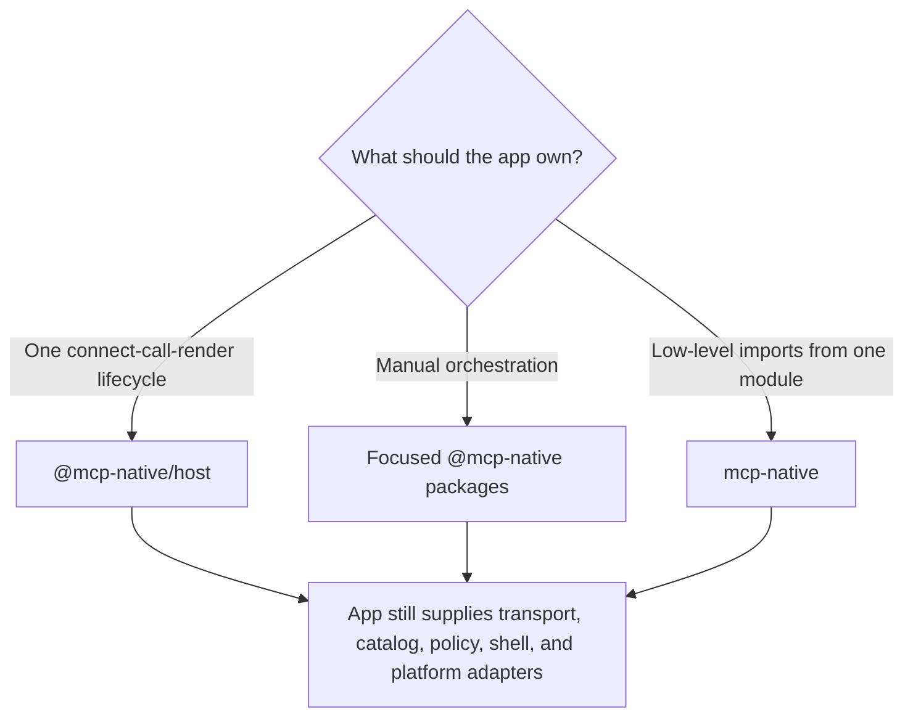
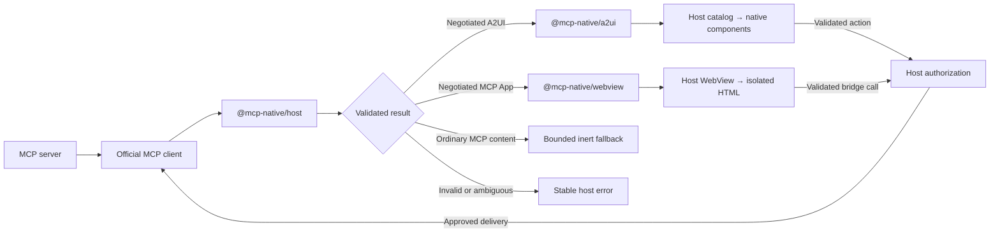

<div align="center">

# MCP Native

### Connect agentic input to host-controlled native applications

Render validated MCP interfaces with components compiled into your app. Use native A2UI for
forms and structured interactions, or isolate HTML MCP Apps behind an explicit WebView policy.

[](https://github.com/pablospaniard/mcp-native/actions/workflows/ci.yml)
[](https://www.npmjs.com/package/mcp-native)
[](https://www.npmjs.com/package/mcp-native)
[](LICENSE)
[](https://www.typescriptlang.org/)

</div>

## The problem

Agents and MCP servers speak in data, intent, and actions. Native applications speak in compiled
components, platform lifecycles, design systems, accessibility semantics, and protected device
capabilities. There is no safe direct handoff between those worlds. Without a reusable bridge,
developers must turn every agent response into chat text, hand-build a screen and integration for
each tool, or embed remote UI that does not behave—or deserve trust—like the rest of the app.

## The solution

MCP Native is the bridge between agentic input and the native application ecosystem. It turns a
negotiated, agent-authored interface description into validated render state and policy-gated
actions that a native host can safely consume. The agent decides what it needs to communicate; the
app decides exactly how that intent looks, behaves, and what it may execute. Your design system,
accessibility, navigation, credentials, permissions, and device integrations remain native and
host-owned.

Build the catalog and policy boundary once, then tools can compose forms, cards, lists, and approval
flows from that approved vocabulary—without a bespoke screen for every result, downloaded
JavaScript, or server-selected components. The maintained renderer today is React Native; the core
runtime and protocol boundaries are UI-framework independent. First-class SwiftUI and Jetpack
Compose renderers are not included yet.

### What this changes in practice

A CRM agent initially asks the app to present a lead summary with Qualify and Reject actions. Later,
it asks for an editable owner and status choice. The intent arrives through A2UI; the native host
maps it onto its approved fields, pickers, and buttons, preserving the app's design system and
platform behavior. The workflow can evolve without another one-off screen. If the agent requests an
unsupported component or action, the host rejects it until the native application explicitly
implements and allows it.

MCP Native includes a headless `@mcp-native/host` controller, its React Native provider and
registered catalog workflow, and independently usable low-level packages. See the
[changelog](CHANGELOG.md) for release history.

## When to use it

Use MCP Native when you need:

- native forms, lists, cards, settings, approvals, or structured tool results;
- local input state, validation, accessibility semantics, and app-owned design-system components;
- an isolated HTML MCP App for content that is better rendered by web technology; or
- one host screen containing separate native and WebView regions.

Do not use it to download JavaScript, resolve arbitrary component names, pass server-authored React
Native props or styles, or expose native APIs directly. Those paths are intentionally unsupported.

## Choose an integration path

| Need                                                                      | Use                                 | Why                                                                               |
| ------------------------------------------------------------------------- | ----------------------------------- | --------------------------------------------------------------------------------- |
| Connect, discover tools, call, classify, and render through one lifecycle | [`@mcp-native/host`](packages/host) | Recommended high-level path, including React Native lifecycle integration         |
| Control connection, parsing, state, or rendering yourself                 | Focused `@mcp-native/*` packages    | Keeps each boundary independently composable                                      |
| Import the low-level runtime and UI layers from one module                | [`mcp-native`](packages/mcp-native) | Convenience re-export; it does not include the MCP SDK adapter or high-level host |



## How a result is handled

The high-level host resolves every successful tool result to exactly one closed outcome. A2UI and
MCP Apps require exact mutual capability negotiation; MIME type alone does not select an executable
renderer. Unknown, ambiguous, malformed, or oversized inputs fail closed.



For native A2UI, the app installs a catalog that maps supported semantic names to its own React
Native primitives or design-system adapters. The renderer has semantics for the pinned A2UI basic
catalog, but the host advertises only components whose local implementation and required policy are
installed. Domain-specific widgets can use an exactly negotiated, locally compiled host extension;
application-defined input-format adapters are separate post-1.0 work.

For MCP Apps, the app supplies a WebView wrapper. MCP Native validates the stable Apps profile and
creates closed sandbox, navigation, storage, permission, bridge, and lifecycle descriptors. HTML
never becomes a native component and receives no device permission by implication.

## Install

The v1 public API is finalized and ready for production integration under the
[1.x compatibility policy](docs/compatibility-policy.md). The commands below select the stable
`1.x` release line. Keep MCP Native packages on the same coordinated version.

For the headless high-level flow, including its React Native provider:

```bash
npm install @mcp-native/host@1 @mcp-native/mcp@1 @modelcontextprotocol/client react
```

For manual composition through one low-level entry point:

```bash
npm install mcp-native@1 react
```

Or install only the focused layers you use:

```bash
npm install @mcp-native/core@1 @mcp-native/a2ui@1 @mcp-native/react-native@1
npm install @mcp-native/webview@1
```

All packages are ESM-only and include TypeScript declarations. React `>=18.1.0` is the only UI peer
dependency. The app supplies React Native, Expo if used, WebView, native components, and other
platform integrations.

## CLI

The `mcp-native` package includes local diagnostics and starter-file generators:

| Command                                                                 | Purpose                                                               |
| ----------------------------------------------------------------------- | --------------------------------------------------------------------- |
| `doctor [directory] [--json]`                                           | Check local package and native setup; optionally print a JSON report. |
| `scaffold-catalog [output-directory]`                                   | Create `mcpNativeCatalog.tsx`, a starter React Native host catalog.   |
| `scaffold-extension <extension-id> <PascalCaseName> [output-directory]` | Create a custom component's contract and local registration skeleton. |
| `help`                                                                  | Print command syntax; `--help` and `-h` are aliases.                  |

Run commands with `npx mcp-native`:

```bash
npx mcp-native doctor
npx mcp-native doctor examples/expo-go-todolist --json
npx mcp-native scaffold-catalog src/mcp
npx mcp-native scaffold-extension com.aily/data-grid DataGrid src/mcp
npx mcp-native help
```

With no command, the CLI runs `doctor`. Optional directories default to the current directory.
Scaffolds create missing folders and never overwrite existing files.

The extension example creates `src/mcp/DataGrid.manifest.json` (the allowed props, events, and
component constraints) and `src/mcp/DataGrid.tsx` (a label placeholder and local registration).
It does not build a working data grid. Implement the component, define allowed props and events,
register it, negotiate support with the MCP server, and configure host policy.

See the [full CLI reference](packages/mcp-native/README.md#cli) for argument and naming rules,
defaults, outputs, and diagnostic exit statuses, and the
[host-extension integration flow](docs/media-and-host-extensions.md#host-extension-flow) for
custom components.

## What the app must provide

MCP Native deliberately does not own the application shell. A production host supplies:

- the server choice, official MCP transport, authentication handoff, and secure credential storage;
- locally compiled native components and the catalog entries advertised to the server;
- action, URL, resource, media, WebView, permission, and user-consent policies;
- navigation, safe areas, scrolling, focus, errors, retries, and app lifecycle integration; and
- platform testing for the exact component library, React Native version, and WebView in the app.

Use the [host integration checklist](docs/host-integration-checklist.md) to wire these
application-owned responsibilities.

## Packages

| Package                                             | Responsibility                                                                            |
| --------------------------------------------------- | ----------------------------------------------------------------------------------------- |
| [`@mcp-native/host`](packages/host)                 | High-level connection, discovery, call, result, lifecycle, and React Native orchestration |
| [`@mcp-native/core`](packages/core)                 | Protocol-independent runtime contracts, JSON validation, resources, actions, and policy   |
| [`@mcp-native/mcp`](packages/mcp)                   | Validated adapter for the official MCP TypeScript SDK and native OAuth helpers            |
| [`@mcp-native/a2ui`](packages/a2ui)                 | A2UI negotiation, parsing, surface state, validation, and action envelopes                |
| [`@mcp-native/react-native`](packages/react-native) | Trusted A2UI render plans and host-owned native component adapters                        |
| [`@mcp-native/webview`](packages/webview)           | MCP Apps validation, native WebView policy, sandbox, and bridge lifecycle                 |
| [`mcp-native`](packages/mcp-native)                 | Convenience re-export of core, A2UI, React Native, WebView, and mixed-surface APIs        |

The split is a security and dependency boundary. In particular, `@mcp-native/core` has no MCP SDK,
A2UI, React, React Native, or WebView dependency.

## API names and protocol versions

Package names provide the implementation context, so current APIs use concise identifiers:

```ts
import { SurfaceStore, parseEnvelope } from "@mcp-native/a2ui";
import { HostSurface, createHost } from "@mcp-native/react-native";

// The convenience package also provides explicit namespaces.
import { a2ui, reactNative } from "mcp-native";
const store = new a2ui.SurfaceStore();
const Surface = reactNative.HostSurface;
```

The package root always means the current supported profile. Exact protocol identity remains in
negotiated values such as `PROTOCOL_VERSION === "v1.0"`, in schemas, and in compatibility docs; it
is not repeated in every TypeScript name. Previous `A2ui*`, `A2uiV1*`, and `A2UI_V1_*` exports
remain compatible aliases throughout the `1.x` line. New code and examples must use the concise
names; see the [repository naming rule](CONTRIBUTING.md#naming).
Existing integrations can follow the [migration guide](docs/migration-to-1.0.md).

## Examples

- [Expo Go todo app](examples/expo-go-todolist/README.md) — native A2UI with local bindings,
  validation, accessible components, host-owned actions, and persistence.
- [City Canvas](examples/expo-go-mixed-surfaces/README.md) — native A2UI and an isolated MCP Apps
  WebView as host-created sibling regions.

Run either example from a built workspace:

```bash
npm ci
npm run build
cd examples/expo-go-todolist # or examples/expo-go-mixed-surfaces
npm ci
npm start
```

## Exact compatibility status

| Surface                | Supported profile                                                                                   |
| ---------------------- | --------------------------------------------------------------------------------------------------- |
| MCP                    | `2026-07-28`, with a tested `2025-11-25` compatibility lane                                         |
| A2UI                   | Feature-scoped v1.0 Candidate profile pinned to commit `8ff4651232ab0e02b0123730b502711170637a3a`   |
| MCP Apps               | Stable `2026-01-26` native host-adapter profile with `@modelcontextprotocol/ext-apps@1.7.5` schemas |
| React                  | Peer dependency `>=18.1.0`                                                                          |
| Direct native renderer | React Native; the package does not claim a React Native version range                               |

As of 2026-09-07, [upstream A2UI versions](https://a2ui.org/#specification-versions) identify
v1.0 as Candidate and v0.9.1 as the current production release. MCP Native supports a pinned,
feature-scoped profile of A2UI v1.0 Candidate. This does not claim full A2UI coverage, v0.9.1
compatibility, or automatic compatibility with later upstream revisions. See the
[implemented profile](docs/a2ui-v1-conformance.md) for supported features and exclusions.

Read the [support matrix](docs/support-matrix.md) and [standards inventory](docs/standards-compatibility.md)
for the exact tested boundaries and exclusions. First-class SwiftUI, Jetpack Compose, capability
providers, custom input contracts, and later protocol profiles are tracked as post-1.0 work without
assigned release dates.

## Documentation

- [Documentation home](docs/README.md) — route to the right guide.
- [CLI reference](packages/mcp-native/README.md#cli) — diagnostics, scaffolds, arguments, and help.
- [Product guide](docs/product-guide.md) — server and host responsibilities in plain language.
- [Architecture](docs/RFC-0001-architecture.md) — package boundaries, data flow, and threat model.
- [Capabilities](docs/capabilities.md) — catalog, design-system, media, and extension behavior.
- [A2UI profile](docs/a2ui-v1-conformance.md) and
  [MCP Apps profile](docs/mcp-apps-compatibility.md) — exact protocol scope.
- [Protocol support](docs/protocol-support.md) — MCP revisions and operations.
- [1.0 readiness](docs/1.0-readiness.md) and [roadmap](docs/roadmap.md) — completed gates and
  publication steps and post-v1 work.
- [Security policy](SECURITY.md) — trust assumptions and vulnerability reporting.

## Development

Requirements: Node.js 22.12 or newer, npm 10 or newer, and Git.

```bash
git clone git@github.com:pablospaniard/mcp-native.git
cd mcp-native
npm ci
npm run check
```

| Command                 | Purpose                                                                      |
| ----------------------- | ---------------------------------------------------------------------------- |
| `npm run build`         | Build every workspace                                                        |
| `npm run check`         | Run formatting, linting, types, schemas, tests, performance, and conformance |
| `npm run package:smoke` | Pack and install every public package in clean consumers                     |
| `npm run format:fix`    | Format supported project files                                               |

## Repository layout

```text
mcp-native/
├── .github/                   # CI and collaboration workflows
├── docs/                      # Guides, architecture, and compatibility references
├── examples/
│   ├── expo-go-todolist/      # Native A2UI workflow
│   └── expo-go-mixed-surfaces/ # Native and MCP Apps sibling regions
├── packages/                  # Seven published packages
└── tests/                     # Cross-package integration and boundary tests
```

Contributions are welcome. Read [CONTRIBUTING.md](CONTRIBUTING.md) before opening a pull request.
Security reports should follow [SECURITY.md](SECURITY.md).

## Support the project

If MCP Native is useful to you, you can [sponsor its development](https://github.com/sponsors/pablospaniard).

## License

MCP Native is available under the [MIT License](LICENSE).
