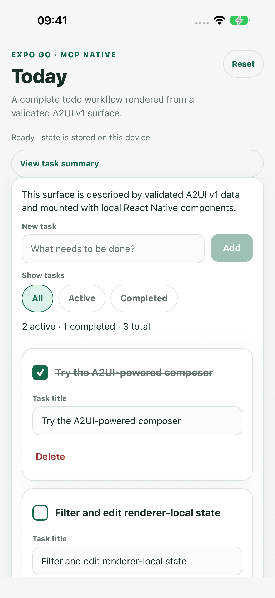

<div align="center">

# MCP Native

### Native application surfaces for the Model Context Protocol

Render trusted, declarative MCP interfaces with host-owned native components—starting with React Native—while keeping HTML MCP Apps behind an explicit WebView policy boundary.

[What MCP Native does](docs/product-guide.md) explains the server-to-screen flow, components,
styling, renderers, extensions, and mixed native/WebView screens in product language.

[](https://github.com/pablospaniard/mcp-native/actions/workflows/ci.yml)
[](https://www.npmjs.com/package/mcp-native)
[](https://www.npmjs.com/package/mcp-native)
[](LICENSE)
[](https://www.typescriptlang.org/)
[](CONTRIBUTING.md)
[](https://github.com/sponsors/pablospaniard)

[Architecture](docs/RFC-0001-architecture.md) · [Mixed surfaces](docs/mixed-surfaces.md) · [Support matrix](docs/support-matrix.md) · [Protocol support](docs/protocol-support.md) · [1.0 readiness](docs/1.0-readiness.md) · [Roadmap](docs/roadmap.md) · [Contributing](CONTRIBUTING.md) · [Security](SECURITY.md)

</div>

> [!IMPORTANT]
> MCP Native `0.9.x` is the feature-complete release candidate for the documented React Native host
> scope. The public API is frozen for `1.0.0`, so teams can integrate and evaluate it now. The stable
> `1.x` compatibility guarantee begins with `1.0.0` after the final independent security,
> accessibility, compatibility, protocol/schema, and native WebView reviews.

> [!TIP]
> New integrations should use the A2UI v1 Candidate flow or the stable MCP Apps `2026-01-26`
> native-host flow. The custom A2UI `0.1` APIs remain available under `/legacy` for migration. See
> the [A2UI profile](docs/a2ui-v1-conformance.md), [MCP Apps profile](docs/mcp-apps-compatibility.md),
> and [standards matrix](docs/standards-compatibility.md) for exact coverage.

## Try the Expo Go proof

<p align="center">
  <a href="examples/expo-go-todolist/README.md">
    
  </a>
</p>

<div align="center">

[][expo-snack-todo]

</div>

The [complete todo app](examples/expo-go-todolist/README.md) is the shortest path from this
repository to a working native surface. It uses the real A2UI v1 lifecycle, trusted React Native
catalog, official action envelopes, renderer-local bindings, validation, filters, editing,
persistence, accessibility, and host-owned action handling.

Open the [live Expo Snack][expo-snack-todo], select **My Device**, and scan its QR code with Expo Go
to run the app without cloning this repository. The Snack opens the complete five-file example and
its published MCP Native package dependencies, so you can inspect and change the code before
launching it.

To run the workspace source locally instead:

```bash
npm ci
npm run build
cd examples/expo-go-todolist
npm ci
npm start
```

Scan the terminal QR code with Expo Go, or press `a`/`i` for an emulator/simulator. The example
README explains each package boundary with copyable code and includes the focused verification
commands.

[expo-snack-todo]: https://snack.expo.dev/?name=MCP+Native+Todo&description=A+complete+Expo+Go+todo+app+rendered+from+validated+A2UI+v1+data+with+trusted+native+components.&sdkVersion=57.0.0&platform=mydevice&supportedPlatforms=ios%2Candroid%2Cmydevice&preview=true&files=%7B%22App.tsx%22%3A%7B%22type%22%3A%22CODE%22%2C%22url%22%3A%22https%3A%2F%2Fraw.githubusercontent.com%2Fpablospaniard%2Fmcp-native%2Fb4d55c9c51bba06601e0ed851b450c6ae8849110%2Fexamples%2Fexpo-go-todolist%2FApp.tsx%22%7D%2C%22src%2Fcatalog.tsx%22%3A%7B%22type%22%3A%22CODE%22%2C%22url%22%3A%22https%3A%2F%2Fraw.githubusercontent.com%2Fpablospaniard%2Fmcp-native%2Fb4d55c9c51bba06601e0ed851b450c6ae8849110%2Fexamples%2Fexpo-go-todolist%2Fsrc%2Fcatalog.tsx%22%7D%2C%22src%2Fdomain.ts%22%3A%7B%22type%22%3A%22CODE%22%2C%22url%22%3A%22https%3A%2F%2Fraw.githubusercontent.com%2Fpablospaniard%2Fmcp-native%2Fb4d55c9c51bba06601e0ed851b450c6ae8849110%2Fexamples%2Fexpo-go-todolist%2Fsrc%2Fdomain.ts%22%7D%2C%22src%2Fstorage.ts%22%3A%7B%22type%22%3A%22CODE%22%2C%22url%22%3A%22https%3A%2F%2Fraw.githubusercontent.com%2Fpablospaniard%2Fmcp-native%2Fb4d55c9c51bba06601e0ed851b450c6ae8849110%2Fexamples%2Fexpo-go-todolist%2Fsrc%2Fstorage.ts%22%7D%2C%22src%2Fsurface.ts%22%3A%7B%22type%22%3A%22CODE%22%2C%22url%22%3A%22https%3A%2F%2Fraw.githubusercontent.com%2Fpablospaniard%2Fmcp-native%2Fb4d55c9c51bba06601e0ed851b450c6ae8849110%2Fexamples%2Fexpo-go-todolist%2Fsrc%2Fsurface.ts%22%7D%7D&dependencies=%40mcp-native%2Fa2ui%40latest%2C%40mcp-native%2Fcore%40latest%2C%40mcp-native%2Freact-native%40latest%2Cexpo-sqlite%40%7E57.0.2%2Cexpo-status-bar%40%7E57.0.1%2Creact-native-safe-area-context%40%7E5.7.0

## How it works

MCP servers can expose much more than text. They can describe tools, resources, actions, and interactive experiences. Today, those experiences often arrive as HTML and run inside an iframe or WebView.

MCP Native provides a complementary path:

- a server describes UI as validated, declarative data;
- the host maps that data to components already bundled with the app;
- validated user actions return to the host for explicit, policy-controlled MCP delivery;
- arbitrary remote React Native JavaScript is never downloaded or executed;
- HTML remains available as a policy-gated compatibility fallback.

The result should feel native to the device while preserving a clear trust boundary between an MCP server and its host application.

## Architecture at a glance

```text
                                  MCP server
                                      │
                  tools/list · tools/call · resources/read
                                      │
                                      ▼
                         ┌────────────────────────┐
                         │ official MCP TS client │
                         └────────────┬───────────┘
                                      │
                                      ▼
                           ┌─────────────────────┐
                           │  @mcp-native/mcp    │
                           │ validated SDK bridge│
                           └──────────┬──────────┘
                                      │
                                      ▼
                            ┌───────────────────┐
                            │ @mcp-native/core  │
                            │ runtime + actions │
                            └─────────┬─────────┘
                                      │
                    ┌─────────────────┴─────────────────┐
                    │                                   │
          declarative A2UI resource              HTML MCP App resource
                    │                                   │
                    ▼                                   ▼
          ┌──────────────────┐               ┌─────────────────────┐
          │ @mcp-native/a2ui │               │ @mcp-native/webview │
          │ parse + validate │               │ sandbox + bridge    │
          └────────┬─────────┘               └─────────────────────┘
                   │
                   ▼
       ┌──────────────────────────┐
       │ @mcp-native/react-native │
       │ trusted native catalog   │
       └────────────┬─────────────┘
                    │
                    ▼
        View · Text · Button · TextInput
                    │
                    └──── validated action ──► host callback / policy-gated tool dispatch
```

Read [RFC-0001](docs/RFC-0001-architecture.md) for the package boundaries, data flow, capability model, and threat model.

## Packages

| Package                                                                              | Source                                           | Responsibility                                                                |
| ------------------------------------------------------------------------------------ | ------------------------------------------------ | ----------------------------------------------------------------------------- |
| [`@mcp-native/core`](https://www.npmjs.com/package/@mcp-native/core)                 | [`packages/core`](packages/core)                 | Transport-neutral runtime contracts, resource access, and action routing      |
| [`@mcp-native/mcp`](https://www.npmjs.com/package/@mcp-native/mcp)                   | [`packages/mcp`](packages/mcp)                   | Validated SDK adapter and protected-HTTP OAuth host boundary                  |
| [`@mcp-native/a2ui`](https://www.npmjs.com/package/@mcp-native/a2ui)                 | [`packages/a2ui`](packages/a2ui)                 | Feature-scoped A2UI v1 Candidate adapter plus deprecated `0.1` migration APIs |
| [`@mcp-native/react-native`](https://www.npmjs.com/package/@mcp-native/react-native) | [`packages/react-native`](packages/react-native) | Trusted render plans, React hooks, and a host-owned component renderer        |
| [`@mcp-native/webview`](https://www.npmjs.com/package/@mcp-native/webview)           | [`packages/webview`](packages/webview)           | Stable MCP Apps discovery, sandbox, native adapter, and JSON-RPC bridge       |
| [`mcp-native`](https://www.npmjs.com/package/mcp-native)                             | [`packages/mcp-native`](packages/mcp-native)     | Convenience entry point for the runtime and UI packages                       |

The packages are intentionally separated so the core runtime does not depend on the official SDK,
React Native, or any single declarative UI protocol. Release `0.9.0` adds host-owned mixed
native/Apps lifecycle, a production-shaped reference host, and the proposed `1.0.0` API freeze.
Release `0.8.0` completed the pinned A2UI basic catalog with policy-gated media and added exactly
negotiated, locally compiled host extensions.
Release `0.7.0` completed the non-media catalog and typed design-system boundary. Release `0.6.0`
completed the Milestone 6 package
boundary with issuer-bound protected-HTTP OAuth, explicit consent gates and persistent host-owned
grants, bounded connection lifecycle coordination, actionable host states, redacted operations, and
production integration guidance. Release `0.5.0` added the stable MCP Apps `2026-01-26` native
host-adapter profile, while `0.4.0` completed the feature-scoped A2UI v1 Candidate adapter. Package
versions are independent of the legacy custom A2UI surface value `"0.1"`.

## Installation

Install the runtime and UI APIs from the convenience package:

```bash
npm install mcp-native react
```

Add React Native `>=0.86.0 <1` when mounting native surfaces. It remains an optional peer because
the host—not this package—selects the platform implementation.

Or install only the layers your host needs:

```bash
npm install @mcp-native/core @mcp-native/a2ui @mcp-native/react-native
```

Add the official SDK adapter when connecting an `@modelcontextprotocol/client` v2 client:

```bash
npm install @mcp-native/mcp @modelcontextprotocol/client
```

Every package is ESM-only and includes TypeScript declarations. Published packages are released from GitHub Actions with signed npm provenance.

## Implemented in `0.9.0`

- A transport-independent MCP client boundary
- A validated adapter for connected clients from the official MCP TypeScript SDK v2
- MCP `2026-07-28` tool/resource field preservation and HTTP handler/fetch integration coverage
- Exact protocol options for the `2026-07-28` target and tested `2025-11-25` compatibility lane
- An issuer-bound interactive OAuth provider for protected Streamable HTTP with official SDK
  discovery/PKCE, exact resource indicators, secure-storage hooks, safe callback completion, and
  host-gated scope escalation
- Bounded reference adapters for an app-owned Keychain/Keystore backend and OS authentication
  session
- Thirty-two pinned official MCP client scenarios, including every scored `2026-07-28`
  authorization scenario, covering the implemented modern HTTP boundary
- Frozen official requirement accounting and shared-cache isolation tests across principals
- Explicit MCP extension settings and mutual negotiation without MIME or metadata inference
- A project-owned, exact-match [A2UI-over-MCP transport binding](docs/a2ui-mcp-binding.md) with ordinary MCP fallback
- Checksum-verified A2UI v1.0 Candidate schemas pinned to an exact upstream revision
- Strict v1 agent/renderer capability metadata with exact shared-catalog negotiation and inline catalogs disabled
- Schema-validated v1 lifecycle JSONL with atomic, ordered create/update/delete surface state
- Fail-closed parsing for every pinned renderer-to-agent message kind without implicit execution
- A pre-render v1 validation boundary with explicit host component, event, and function allowlists plus bounded validation of literal `formatString` sources
- A fail-closed adapter for every basic-catalog component into the trusted native render plan
- Bounded dynamic `List` template expansion with relative bindings, local edits, and `@index`
- Bounded `formatString` interpolation over validated bindings, JSON values, and nested supported functions
- Host-localized `formatNumber` and `formatCurrency` execution with bounded, validated options
- Bounded `required`, `regex`, `length`, `numeric`, and `email` validation with renderer-side field and button checks
- Host-localized CLDR plural selection and strict `and`, `or`, and `not` evaluation
- A mounted v1 native surface covering every basic-catalog component, with typed renderer-local bindings, dispatch-time event resolution, schema-validated renderer-to-agent action envelopes, and deny-by-default image/media grants
- Host-owned native A2UI and isolated MCP Apps sibling composition with bounded lifecycle,
  accessibility order, focus, environment, crash recovery, and teardown coordination
- Typed `tools/call` action routing with a fail-closed host policy
- Consent profiles across core dispatch/direct calls, MCP Apps callbacks, and A2UI delivery, with bounded expiring/revocable grants
- Bounded SDK connection lifecycle coordination, actionable host states, and data-free operational events
- Shared finite, acyclic JSON validation with safe handling of prototype-named keys
- Strict resolution of `application/a2ui+json` resource links from real tool results
- Frozen strict parsing for the deprecated custom `0.1` surface behind legacy migration APIs
- Conversion from a validated surface to a trusted native render plan
- Mounting through a required four-primitive base plus optional host-provided components
- Typed adapters from trusted semantic props into locally bundled design-system components
- Exact namespaced host-extension manifests, negotiation, opaque registries, local Fabric
  registration, capability grants, and schema-valid events with inline catalogs disabled
- React hooks for memoized render plans and safely observed asynchronous action dispatch
- Accessibility labels and controlled text-input binding events selected at the renderer boundary
- Fail-closed behavior for unknown nodes, actions, protocol versions, and WebView MIME types
- Fixed A2UI parser/state/render-plan budgets and deterministic generated hostile-input coverage
- A WebView policy that denies remote documents unless the host explicitly allows them
- Stable MCP Apps `2026-01-26` MIME negotiation, `_meta.ui` discovery/visibility, and exact
  `ui://` text/blob resource loading
- A closed CSP-first native WebView sandbox, React Native WebView safe-prop adapter, and bounded
  JSON-RPC lifecycle verified against official `@modelcontextprotocol/ext-apps@1.7.5` schemas
- TypeScript project references, package exports, tests, and GitHub Actions CI

The documented profiles define the supported MCP, A2UI, and MCP Apps coverage. The v1 native
adapter supports every basic-catalog component, typed absolute and dynamic-list-relative bindings, bounded
formatting and validation functions, pure boolean functions, `@index`, action events returned to a
host callback, required host image/media grants, press-time host-policy-gated HTTP(S) `openUrl`, and
exactly negotiated local host extensions. The profile records agent-initiated renderer functions
and platform behavior outside the automated native fixtures as future extensions. Release `0.6.0` includes policy gates at all
current action boundaries, persistent expiring/revocable consent grants and OAuth scope history,
bounded connection lifecycle coordination, actionable host states, redacted operational events, and
a [production host checklist](docs/host-integration-checklist.md). The runnable
[Expo Go todo app](examples/expo-go-todolist/README.md) demonstrates those boundaries as a complete
native workflow alongside the package release gates.

## Protected Streamable HTTP OAuth

Release `0.6.0` completes the Milestone 6 package work. `@mcp-native/mcp` provides the interactive
OAuth host boundary while the official SDK owns protected-resource and authorization-server
discovery, PKCE, scope selection, issuer validation, token exchange, refresh, and bearer attachment:

```ts
import { Client, UnauthorizedError } from "@modelcontextprotocol/client";
import { createMcpNativeClientOptions } from "@mcp-native/mcp";
import {
  createMcpNativeOAuthAuthorizationSession,
  createMcpNativeOAuthPlatformSecureStore,
  createMcpNativeOAuthProvider,
  createMcpNativeOAuthTransport,
} from "@mcp-native/mcp/oauth";

const serverUrl = new URL("https://mcp.example.com/mcp");
const redirectUrl = "my-app://oauth/callback";
const secureOAuthStore = createMcpNativeOAuthPlatformSecureStore({
  namespace: "com.example.myapp.production", // app-owned constant, never a server value
  backend: keychainOrKeystoreBackend,
});
const authorizationSession = createMcpNativeOAuthAuthorizationSession({
  redirectUrl,
  open: openSystemAuthenticationSession,
});
const provider = createMcpNativeOAuthProvider({
  serverUrl,
  redirectUrl,
  clientMetadata: {
    client_name: "My native host",
    redirect_uris: [redirectUrl],
  },
  storage: secureOAuthStore,
  scopeStore: durableResourceBoundScopeStore,
  createState: () => createCryptographicallyRandomState(),
  openAuthorization: authorizationSession.openAuthorization,
  approveReauthorization: (request) => consentAndCheckRetryBudget(request),
});

const client = new Client(
  { name: "my-native-host", version: "1.0.0" },
  createMcpNativeClientOptions("modern-only"),
);
const transport = createMcpNativeOAuthTransport(serverUrl, provider, {
  scopeEscalation: "host-approved",
});

try {
  await client.connect(transport);
} catch (error) {
  if (!(error instanceof UnauthorizedError)) throw error;
  await authorizationSession.finishAuthorization(provider, transport);
  // Reconnect the Client with a fresh transport as required by SDK v2.
}
```

The provider rejects cross-issuer stored credentials, issuer query/fragment components, a
protected-resource mismatch, insecure endpoints, any unsafe URI in the registered redirect list,
duplicate registered redirect query names, literal fragment delimiters on server, redirect,
authorization, and callback URLs, redirect/state/parameter substitution, duplicate callback fields,
configured redirects that leave insufficient callback parameter or URL capacity, oversized
individual or cumulative registration, discovery, and token data, and raw
`Authorization`, `Cookie`, or `Proxy-Authorization` transport headers. These budgets apply before
schema parsing, persistence, or reuse, including to complete token-response extension structures,
and every actionable discovery endpoint must use HTTPS or an
HTTP loopback address and contain no fragment before the metadata can be cached or returned. By
default, runtime
`insufficient_scope` challenges are surfaced to the host. The opt-in `host-approved` path calls
`approveReauthorization` for every authorization retry while credentials exist—including repeated
same-scope challenges—and permits at most one SDK retry per request. An optional durable scope store
keeps exact protected-resource/issuer-bound scope history across provider instances and token
invalidation; full invalidation clears it. The secure store also retains the exact pending
authorization scopes for the lifetime of the reserved state/verifier attempt, including process
recovery, while ordinary refreshes continue to inherit only previously granted scopes. The callback error path never
renders attacker-controlled OAuth descriptions. A cancelled OS session clears pending state and
PKCE material without deleting registrations or tokens; direct cancellation is rejected until an
active state setup, system handoff, or callback completion has settled. A claimed callback state
keeps the shared namespace reserved until verifier cleanup succeeds, so another provider cannot
replace the verifier during token exchange. The reservation is bound to its live provider, so a
second provider sharing the namespace also cannot cancel or clear the first provider's attempt;
full and verifier credential invalidation follow the same guard. Stale cleanup remains available after process
restart. Authorization URLs are bounded before browser handoff, and both native-session and direct
process-recovery callbacks have total and per-parameter budgets before code redemption. A handoff
is allowed only after the provider has reserved state and saved exactly one PKCE verifier for the
attempt. All 25 scored official
authorization scenarios pass. Production hosts remain responsible for choosing app-owned
secure-storage and authentication-session implementations
and for the broader consent and lifecycle controls described below.

## A2UI v1 Candidate host flow

Given a connected MCP runtime and SDK adapter, a host negotiates the project binding, resolves the
ordered JSONL resource, applies it to the bounded store, defines its explicit policy, and mounts the
supported native subset:

```tsx
import {
  A2uiSurfaceStore,
  createA2uiV1BasicCatalogPolicy,
  negotiateA2uiMcpBinding,
  resolveA2uiV1JsonlFromToolResult,
} from "@mcp-native/a2ui";
import {
  A2uiV1NativeSurface,
  getA2uiV1NativeSupportedComponentNames,
} from "@mcp-native/react-native";
import { Button, Linking, Text, TextInput, View } from "react-native";

const binding = negotiateA2uiMcpBinding(
  adapter.getClientExtensionSettings(),
  adapter.getServerExtensionSettings(),
);
if (binding.kind !== "negotiated") {
  throw new Error("Use the tool result's ordinary MCP fallback content");
}

const toolResult = await runtime.callTool("open_profile");
const { envelopes } = await resolveA2uiV1JsonlFromToolResult(runtime, toolResult, binding);
const store = new A2uiSurfaceStore();
store.applyAll(envelopes);

const surface = store.get("profile");
if (surface === undefined) {
  throw new Error("The A2UI stream did not create the profile surface");
}

const components = { Button, Text, TextInput, View };
const policy = createA2uiV1BasicCatalogPolicy({
  allowedComponentNames: getA2uiV1NativeSupportedComponentNames(components),
  allowedEventNames: ["save_profile"],
  allowedFunctionNames: [
    "formatString",
    "formatNumber",
    "pluralize",
    "and",
    "or",
    "not",
    "openUrl",
  ],
});

function ProfileScreen() {
  return (
    <A2uiV1NativeSurface
      surface={surface}
      policy={policy}
      components={components}
      onAction={(envelope, dataModel) => {
        void deliverA2uiAction(envelope, dataModel);
      }}
      openUrlPolicy={({ url }) => new URL(url).origin === "https://docs.example.com"}
      onOpenUrl={({ url }) => {
        void Linking.openURL(url).catch(reportOpenUrlError);
      }}
    />
  );
}
```

`onAction` receives a validated official envelope and, only after surface opt-in, the renderer-local
data model. `deliverA2uiAction` is deliberately host-owned: the package does not choose or invoke
a renderer-to-agent transport. `openUrl` needs all three grants: the catalog function allowlist,
the synchronous `openUrlPolicy`, and `onOpenUrl`. The adapter accepts only bounded, credential-free
HTTP(S) URLs, resolves the current value during the originating Button press, and calls the host
opener only when the policy returns exactly `true`.

## Legacy custom `0.1` example

```tsx
import { parseA2uiSurface } from "@mcp-native/a2ui/legacy";
import type { McpNativeRuntime } from "@mcp-native/core";
import { McpNativeSurface, useMcpNativeActionDispatcher } from "@mcp-native/react-native/legacy";
import { Button, Text, TextInput, View } from "react-native";

const components = { Button, Text, TextInput, View };

const surface = parseA2uiSurface({
  version: "0.1",
  root: {
    id: "welcome",
    type: "container",
    children: [
      { id: "title", type: "text", text: "Hello from MCP" },
      {
        id: "continue",
        type: "button",
        label: "Continue",
        action: {
          type: "tool",
          name: "continue_onboarding",
          arguments: { accepted: true },
        },
      },
    ],
  },
});

function NativeScreen({ runtime }: { runtime: McpNativeRuntime }) {
  const onAction = useMcpNativeActionDispatcher(runtime, {
    onError: (error) => console.error("MCP action failed", error),
  });

  return <McpNativeSurface surface={surface} components={components} onAction={onAction} />;
}
```

Connected hosts can resolve the same validated surface from a tool result:

```ts
import { resolveA2uiResourceFromToolResult } from "@mcp-native/a2ui/legacy";

const toolResult = await runtime.callTool("open_surface");
const { surface } = await resolveA2uiResourceFromToolResult(runtime, toolResult);
```

This deprecated resolver requires exactly one `application/a2ui+json` resource link, reads the matching text resource, and passes it through the same strict parser. The `parseA2uiSurface` parser handles MCP Native's frozen legacy `0.1` model. It is separate from the JSONL v1 Candidate flow above and has a different wire format. New hosts should follow the [v1 migration guide](docs/a2ui-v1-conformance.md#custom-01-migration).

## Standards status

MCP Native combines strict validation, host-owned catalogs, transport-independent core contracts,
explicit capability boundaries, and deny-by-default HTML policy. The [feature-scoped A2UI v1.0
Candidate profile](docs/a2ui-v1-conformance.md) records the exact pinned schemas, lifecycle,
catalog, renderer-message, policy, and native-renderer coverage. The [stable MCP Apps native
profile](docs/mcp-apps-compatibility.md) records discovery, resources, metadata, sandbox controls,
the supported Apps JSON-RPC lifecycle, and the native isolation contract. See [Standards and
compatibility](docs/standards-compatibility.md) for the combined verified matrix and planned profile
extensions.

## Security model

The central rule is simple:

> Remote MCP servers may provide declarative UI and actions, but MCP Native never downloads and executes arbitrary React Native JavaScript.

That rule leads to a few hard requirements:

1. Treat every server-provided value as untrusted input.
2. Validate protocol versions, nodes, actions, bindings, and MIME types before rendering.
3. Let the host own the effective component and capability allowlists.
4. Fail closed when input is unknown or unsupported.
5. Broker sensitive device capabilities through the host; declarations never grant access by themselves.
6. Keep WebView navigation, origins, bridge messages, storage, and permissions behind an explicit policy.

Please read [SECURITY.md](SECURITY.md) before reporting a vulnerability or proposing a change to a trust boundary.

## Development setup

Requirements:

- Node.js 22 or newer
- npm 10 or newer
- Git

```bash
git clone git@github.com:pablospaniard/mcp-native.git
cd mcp-native
npm ci
npm test
```

Useful commands:

| Command                    | Purpose                                                         |
| -------------------------- | --------------------------------------------------------------- |
| `npm run build`            | Build every workspace with TypeScript project references        |
| `npm run check`            | Run formatting, linting, types, schemas, tests, and conformance |
| `npm run format:check`     | Check formatting without changing files                         |
| `npm run format:fix`       | Format supported project files with Oxfmt                       |
| `npm run lint`             | Check source files with Oxlint                                  |
| `npm run lint:fix`         | Apply safe Oxlint fixes, then report any remaining diagnostics  |
| `npm run typecheck`        | Type-check all TypeScript project references                    |
| `npm test`                 | Build and run the Node test suite                               |
| `npm run test:coverage`    | Run tests and enforce coverage thresholds                       |
| `npm run test:performance` | Enforce documented A2UI performance regression budgets          |
| `npm run schemas:verify`   | Verify the pinned A2UI schema bundle and runtime copies         |
| `npm run package:smoke`    | Build, pack, and install all publishable packages offline       |
| `npm run clean`            | Remove TypeScript project build outputs                         |

Maintainers should follow the tokenless [release and package-onboarding process](docs/releasing.md).

## Repository layout

```text
mcp-native/
├── .github/                   # CI, ownership, and collaboration templates
├── docs/                      # Architecture decisions and design notes
├── examples/
│   └── expo-go-todolist/      # Runnable Expo Go A2UI todo proof and walkthrough
├── packages/
│   ├── core/
│   ├── mcp/
│   ├── a2ui/
│   ├── react-native/
│   ├── webview/
│   └── mcp-native/
└── tests/                     # Cross-package integration and boundary tests
```

The Expo Go todo app is the maintained application-level proof for the React Native primitives
catalog. It pins its Expo and React Native dependencies, includes screenshots and package-level code
examples, and exercises the representative workflow. Repository checks and package smoke tests
remain the release gates.

## Roadmap

The detailed [standards-first roadmap](docs/roadmap.md) records retained architecture, milestone exit criteria, and deferred optional extensions. The [`1.0.0` readiness checklist](docs/1.0-readiness.md) shows which promotion gates are already automated and which final review and publication actions remain.

Release `0.9.0` completes mixed native/WebView composition and freezes the proposed `1.0.0` API.
The remaining release path is:

- `0.7.0`: released—the non-media pinned A2UI basic catalog and closed design-system mappings;
- `0.8.0`: released—policy-gated media and namespaced, schema-validated, locally compiled host
  extensions;
- `0.9.0`: released—host-owned mixed native/WebView composition, a production-shaped reference
  host, and a frozen `1.0.0` release-candidate API;
- `1.0.0`: independent review, full documented-profile gates, stable compatibility policy, complete
  human and technical documentation, and coordinated provenance publishing.

The `1.0.0` scope remains a React Native host library. It does not expose server-selected React
Native packages, native classes, arbitrary props or styles, or direct SwiftUI/Compose renderers.
Applications may use locally compiled Fabric components through the closed host-extension boundary.
In `0.9.0`, native A2UI and isolated MCP Apps WebView regions may share a host screen, but
neither protocol will configure or escape the other's policy boundary.

After `1.0.0`, development continues with first-class SwiftUI and Jetpack Compose renderers and a
universal native-capability provider framework. “Universal” means any current or future platform
capability can be integrated through a typed, versioned, advertised, host-owned, policy-gated
provider—not that every device API is automatically exposed to a server. The detailed roadmap keeps
renderer parity, common capability profiles, security gates, and exact platform matrices as explicit
post-stable deliverables.

- [x] Define protocol-independent runtime and action contracts
- [x] Validate a minimal declarative UI surface
- [x] Produce a trusted native render plan
- [x] Establish a policy-gated WebView boundary
- [x] Add an adapter for the official MCP TypeScript SDK
- [x] Resolve declarative UI resources from real tool results
- [x] Render host-provided React Native components through production-facing hooks
- [x] Inventory normative standards and publish explicit compatibility status
- [x] Preserve MCP `2026-07-28` tool/resource fields and test the current HTTP path
- [x] Pin official MCP conformance scenarios and document backwards compatibility
- [x] Add extension negotiation and metadata-preserving capability contracts
- [x] Implement the pinned A2UI v1.0 adapter from schemas, lifecycle envelopes, and ordered state
- [x] Add a policy-gated pre-render boundary for basic-catalog graphs, bindings, events, and functions
- [x] Adapt the supported A2UI v1 subset, including bounded dynamic lists, into the trusted native render plan
- [x] Add renderer-local string state, dispatch-time action context, and official action envelopes
- [x] Execute bounded A2UI `formatString` interpolation and `@index` offsets
- [x] Execute host-localized A2UI `formatNumber` and `formatCurrency`
- [x] Execute bounded host-localized A2UI `formatDate` with the pinned token subset
- [x] Execute host-localized A2UI `pluralize` and pure `and`, `or`, and `not`
- [x] Implement bounded policy-gated HTTP(S) `openUrl` with explicit user activation
- [x] Add typed adapters for host-owned React Native component libraries
- [x] Add closed host-owned component variants for supported A2UI structure and style hints
- [x] Derive closed native text/button semantics and preserve text scaling at the host boundary
- [x] Complete all non-media basic-catalog components with typed bindings and accessibility semantics
- [x] Require bounded image grants, pinned icon mappings, and exact installed-subset advertising
- [x] Add policy-gated `Video` and `AudioPlayer` with cumulative media budgets
- [x] Add exact namespaced host-extension manifests, negotiation, local Fabric registration, and
      UIKit/Android View fixtures
- [x] Parse every pinned renderer-to-agent message kind and publish the feature-scoped conformance profile
- [x] Enforce A2UI parse, update, render-plan, and retained-memory budgets with deterministic fuzz coverage
- [x] Generate an RN 0.86.0 minimum-support host and exercise automated bundle, host-boundary,
      Android-build, and iOS-build checks on pull requests
- [x] Complete the documented real-platform accessibility behavior
- [x] Execute the supported iOS/Android fixture and accessibility matrix in generated real hosts
- [x] Coordinate host-owned native and isolated Apps sibling regions across complete lifecycle
- [x] Freeze and verify the proposed public API, compatibility policy, support matrix, and migration
      path
- [x] Implement stable MCP Apps `2026-01-26` discovery, native sandboxing, and bridge compatibility
- [x] Add the issuer-bound MCP HTTP OAuth provider, secure-storage seam, and safe callback boundary
- [x] Pass every scored pinned official `2026-07-28` authorization client scenario
- [x] Add bounded Keychain/Keystore and OS authentication-session reference adapters
- [x] Add bounded core `dispatch()` tool-risk, capability, and privacy consent descriptors
- [x] Integrate consent policy across current action boundaries and add persistent, expiring grants
- [x] Define production connection lifecycle, observable error states, diagnostic redaction, and host integration guidance
- [x] Maintain a runnable Expo Go primitives proof with a complete workflow and package walkthrough
- [ ] Expand protocol coverage through reviewed RFCs and tests

## Contributing

Contributions are welcome. All changes—including maintainer changes—go through pull requests and must pass CI before merging.

Start with [CONTRIBUTING.md](CONTRIBUTING.md). By participating, you agree to follow the [Code of Conduct](CODE_OF_CONDUCT.md).

## Sponsors

Building this in public. If mcp-native helped you, [buy me a coffee](https://github.com/sponsors/pablospaniard) — it goes a long way.

## License

MCP Native is available under the [MIT License](LICENSE).
