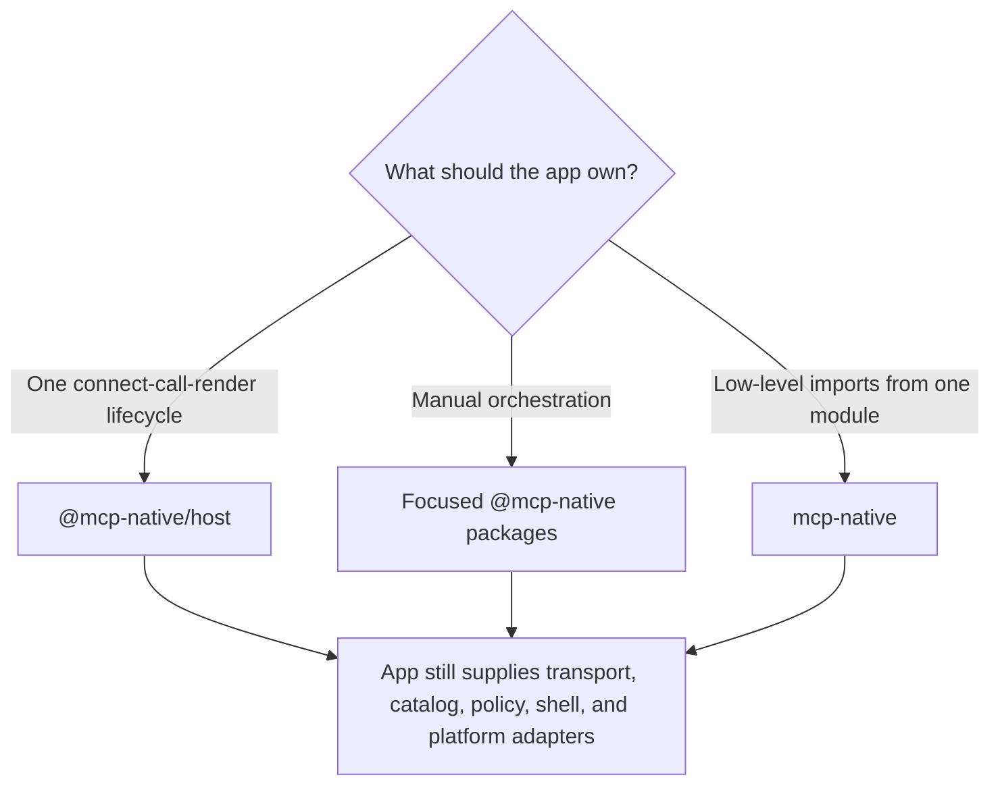
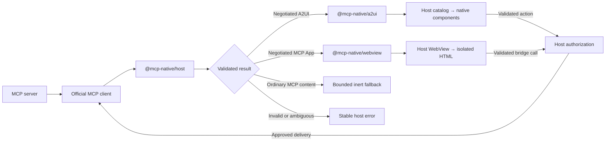

<div align="center">

# MCP Native

### Host-controlled native interfaces for the Model Context Protocol

Render validated MCP interfaces with components compiled into your app. Use native A2UI for
forms and structured interactions, or isolate HTML MCP Apps behind an explicit WebView policy.

[](https://github.com/pablospaniard/mcp-native/actions/workflows/ci.yml)
[](https://www.npmjs.com/package/mcp-native)
[](https://www.npmjs.com/package/mcp-native)
[](LICENSE)
[](https://www.typescriptlang.org/)

</div>

MCP Native is a policy-gated host runtime, not a remote component loader. An MCP server may request
a semantic component that the app advertised, such as `Button` or `TextField`. It cannot select the
React Native implementation, import code, pass arbitrary props or styles, or gain device access.

MCP Native includes a headless `@mcp-native/host` controller, its React Native provider and
registered catalog workflow, and independently usable low-level packages. See the
[changelog](CHANGELOG.md) for release history.

## When to use it

Use MCP Native when you need:

- native forms, lists, cards, settings, approvals, or structured tool results;
- local input state, validation, accessibility semantics, and app-owned design-system components;
- an isolated HTML MCP App for content that is better rendered by web technology; or
- one host screen containing separate native and WebView regions.

Do not use it to download JavaScript, resolve arbitrary component names, pass server-authored React
Native props or styles, or expose native APIs directly. Those paths are intentionally unsupported.

## Choose an integration path

| Need                                                                      | Use                                 | Why                                                                               |
| ------------------------------------------------------------------------- | ----------------------------------- | --------------------------------------------------------------------------------- |
| Connect, discover tools, call, classify, and render through one lifecycle | [`@mcp-native/host`](packages/host) | Recommended high-level path, including React Native lifecycle integration         |
| Control connection, parsing, state, or rendering yourself                 | Focused `@mcp-native/*` packages    | Keeps each boundary independently composable                                      |
| Import the low-level runtime and UI layers from one module                | [`mcp-native`](packages/mcp-native) | Convenience re-export; it does not include the MCP SDK adapter or high-level host |



## How a result is handled

The high-level host resolves every successful tool result to exactly one closed outcome. A2UI and
MCP Apps require exact mutual capability negotiation; MIME type alone does not select an executable
renderer. Unknown, ambiguous, malformed, or oversized inputs fail closed.



For native A2UI, the app installs a catalog that maps supported semantic names to its own React
Native primitives or design-system adapters. The renderer has semantics for the pinned A2UI basic
catalog, but the host advertises only components whose local implementation and required policy are
installed. Domain-specific widgets can use an exactly negotiated, locally compiled host extension;
application-defined input-format adapters are separate post-1.0 work.

For MCP Apps, the app supplies a WebView wrapper. MCP Native validates the stable Apps profile and
creates closed sandbox, navigation, storage, permission, bridge, and lifecycle descriptors. HTML
never becomes a native component and receives no device permission by implication.

## Install

For the headless high-level flow, including its React Native provider:

```bash
npm install @mcp-native/host @mcp-native/mcp @modelcontextprotocol/client react
```

For manual composition through one low-level entry point:

```bash
npm install mcp-native react
```

Or install only the focused layers you use:

```bash
npm install @mcp-native/core @mcp-native/a2ui @mcp-native/react-native
npm install @mcp-native/webview
```

All packages are ESM-only and include TypeScript declarations. React `>=18.1.0` is the only UI peer
dependency. The app supplies React Native, Expo if used, WebView, native components, and other
platform integrations.

## What the app must provide

MCP Native deliberately does not own the application shell. A production host supplies:

- the server choice, official MCP transport, authentication handoff, and secure credential storage;
- locally compiled native components and the catalog entries advertised to the server;
- action, URL, resource, media, WebView, permission, and user-consent policies;
- navigation, safe areas, scrolling, focus, errors, retries, and app lifecycle integration; and
- platform testing for the exact component library, React Native version, and WebView in the app.

Start with the [host integration checklist](docs/host-integration-checklist.md) before treating an
integration as production-ready.

## Packages

| Package                                             | Responsibility                                                                            |
| --------------------------------------------------- | ----------------------------------------------------------------------------------------- |
| [`@mcp-native/host`](packages/host)                 | High-level connection, discovery, call, result, lifecycle, and React Native orchestration |
| [`@mcp-native/core`](packages/core)                 | Protocol-independent runtime contracts, JSON validation, resources, actions, and policy   |
| [`@mcp-native/mcp`](packages/mcp)                   | Validated adapter for the official MCP TypeScript SDK and native OAuth helpers            |
| [`@mcp-native/a2ui`](packages/a2ui)                 | A2UI negotiation, parsing, surface state, validation, and action envelopes                |
| [`@mcp-native/react-native`](packages/react-native) | Trusted A2UI render plans and host-owned native component adapters                        |
| [`@mcp-native/webview`](packages/webview)           | MCP Apps validation, native WebView policy, sandbox, and bridge lifecycle                 |
| [`mcp-native`](packages/mcp-native)                 | Convenience re-export of core, A2UI, React Native, WebView, and mixed-surface APIs        |

The split is a security and dependency boundary. In particular, `@mcp-native/core` has no MCP SDK,
A2UI, React, React Native, or WebView dependency.

## Examples

- [Expo Go todo app](examples/expo-go-todolist/README.md) — native A2UI with local bindings,
  validation, accessible components, host-owned actions, and persistence.
- [City Canvas](examples/expo-go-mixed-surfaces/README.md) — native A2UI and an isolated MCP Apps
  WebView as host-created sibling regions.

Run either example from a built workspace:

```bash
npm ci
npm run build
cd examples/expo-go-todolist # or examples/expo-go-mixed-surfaces
npm ci
npm start
```

## Exact compatibility status

| Surface                | Supported profile                                                                                   |
| ---------------------- | --------------------------------------------------------------------------------------------------- |
| MCP                    | `2026-07-28`, with a tested `2025-11-25` compatibility lane                                         |
| A2UI                   | Feature-scoped v1.0 Candidate profile pinned to commit `7541f953050cd58b80f0bf5d85fe2d63192af305`   |
| MCP Apps               | Stable `2026-01-26` native host-adapter profile with `@modelcontextprotocol/ext-apps@1.7.5` schemas |
| React                  | Peer dependency `>=18.1.0`                                                                          |
| Direct native renderer | React Native; the package does not claim a React Native version range                               |

Read the [support matrix](docs/support-matrix.md) and [standards inventory](docs/standards-compatibility.md)
for the exact tested boundaries and exclusions. First-class SwiftUI, Jetpack Compose, capability
providers, custom input contracts, and later protocol profiles are tracked as post-1.0 work without
assigned release dates.

## Documentation

- [Documentation home](docs/README.md) — route to the right guide.
- [Product guide](docs/product-guide.md) — server and host responsibilities in plain language.
- [Architecture](docs/RFC-0001-architecture.md) — package boundaries, data flow, and threat model.
- [Capabilities](docs/capabilities.md) — catalog, design-system, media, and extension behavior.
- [A2UI profile](docs/a2ui-v1-conformance.md) and
  [MCP Apps profile](docs/mcp-apps-compatibility.md) — exact protocol scope.
- [Protocol support](docs/protocol-support.md) — MCP revisions and operations.
- [1.0 readiness](docs/1.0-readiness.md) and [roadmap](docs/roadmap.md) — completed gates and
  remaining work.
- [Security policy](SECURITY.md) — trust assumptions and vulnerability reporting.

## Development

Requirements: Node.js 22.12 or newer, npm 10 or newer, and Git.

```bash
git clone git@github.com:pablospaniard/mcp-native.git
cd mcp-native
npm ci
npm run check
```

| Command                 | Purpose                                                                      |
| ----------------------- | ---------------------------------------------------------------------------- |
| `npm run build`         | Build every workspace                                                        |
| `npm run check`         | Run formatting, linting, types, schemas, tests, performance, and conformance |
| `npm run package:smoke` | Pack and install every public package in clean consumers                     |
| `npm run format:fix`    | Format supported project files                                               |

## Repository layout

```text
mcp-native/
├── .github/                   # CI and collaboration workflows
├── docs/                      # Guides, architecture, and compatibility references
├── examples/
│   ├── expo-go-todolist/      # Native A2UI workflow
│   └── expo-go-mixed-surfaces/ # Native and MCP Apps sibling regions
├── packages/                  # Seven published packages
└── tests/                     # Cross-package integration and boundary tests
```

Contributions are welcome. Read [CONTRIBUTING.md](CONTRIBUTING.md) before opening a pull request.
Security reports should follow [SECURITY.md](SECURITY.md).

## Support the project

If MCP Native is useful to you, you can [sponsor its development](https://github.com/sponsors/pablospaniard).

## License

MCP Native is available under the [MIT License](LICENSE).
