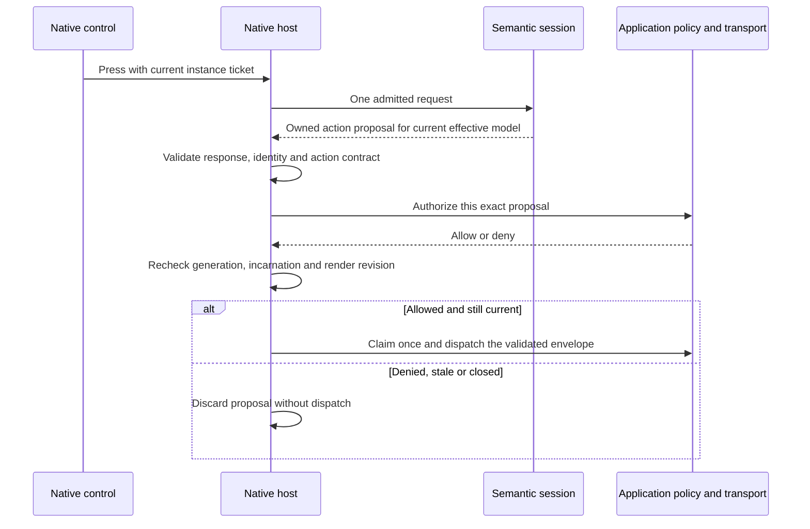

# RFC-0003: Shared native session contract

- Status: Proposed; behavioral design for review, not an implemented or frozen API
- Date: 2026-09-12
- Baseline: integration commit `7535b4b917c33b35f6d0bacdb0012dd732a35105` (PR #133)
- Tracking: [milestone 12 / #92](https://github.com/pablospaniard/mcp-native/issues/92)
- Depends on: [architecture](RFC-0001-architecture.md), [runtime/package assessment](RFC-0002-native-platforms.md)

## Decision proposed

Give platform renderers one semantic session boundary that owns server state, effective local state,
planning and action resolution. Keep transport, authorization, native controls, navigation and device
lifecycle in the application host. Implement and test this boundary as an internal module first.
The initial implementation candidate reuses the existing JavaScript semantics; this RFC does not
select the production engine, publish renderer-core, add a package, or complete milestone 12.

The central design choice is a serial semantic state machine with immutable, bounded results.
Native callbacks identify the exact rendered instance that installed them. An action result is a
proposal requiring native authorization, not permission to dispatch. Logical cancellation makes a
session unusable immediately even where physical engine interruption is not yet demonstrated.

All requirements below are **proposed project policy** for new native sessions. They do not add
requirements to MCP/A2UI or retroactively change published React Native behavior. Terms and operation
names describe responsibilities, not new exports or a bridge wire schema. A follow-up implementation
PR must provide the closed request/result schemas and executable race tests before claiming this
contract. New identifiers follow the [version-neutral naming rule](../CONTRIBUTING.md#naming).

## Exact profile and source of truth

The wire version remains A2UI `v1.0` Candidate
`8ff4651232ab0e02b0123730b502711170637a3a`. Preserve the vendored
[agent-to-renderer](../packages/a2ui/src/v1/vendor/agent_to_renderer.json),
[renderer-to-agent](../packages/a2ui/src/v1/vendor/renderer_to_agent.json) and
[catalog](../packages/a2ui/src/v1/vendor/catalog.json) schemas and the existing
[feature-scoped interpretations](a2ui-v1-conformance.md). Unknown versions, MIME types, components,
functions, actions and fields continue to reject at their applicable boundary. Generic API names
never mean automatic negotiation of a newer profile.

The first internal implementation targets the existing basic-form corpus: `Column`, `List`, `Text`,
`TextField`, `CheckBox`, `Button`, `required`, the covered `formatDate` behavior and `submit`.
Each host can narrow the allowlist. This is not full catalog/function support. Exact field/format
restrictions must remain in the selected adapter's profile; the Swift experiment's narrower schema
coverage does not redefine the production TypeScript validator. For comparison, retain the common
ASCII identifier/key restriction and Unicode string values until exact cross-language key identity
has separate tests. The Android/JavaScript implementations may support more than this intersection.

The [shared corpus](../tests/fixtures/renderer-conformance/README.md) documents existing observable
semantics and the provenance of its expectations.
If an expectation conflicts with a pinned normative rule, resolve and document that conflict rather
than treating the TypeScript implementation as the specification. The async rules introduced here
need additional project-owned scenarios; passing the current corpus alone is insufficient.

## Ownership

| Owner                 | Responsibilities                                                                                                                                                  | Data it cannot authorize                                                                           |
| --------------------- | ----------------------------------------------------------------------------------------------------------------------------------------------------------------- | -------------------------------------------------------------------------------------------------- |
| Semantic session      | Strict input validation, ordered store updates, local binding writes, effective-model validation, planning, reachable-instance resolution and action construction | Transport calls, native capabilities, route/class selection or executable code                     |
| Native host           | Trusted profile and limits, session identity, admission, result validation, cancellation, action consent/delivery, bounded pending work and lifecycle             | Unknown server syntax, an undeclared component, or permissive defaults for missing semantic policy |
| Platform view adapter | Render a validated plan using a closed host registry; bind native callbacks to current instance tickets; own focus/accessibility/layout integration               | Raw server props, arbitrary components, or action payloads fabricated from native labels           |
| MCP adapter           | Existing negotiated input classification and transport boundary; feed owned envelopes to the session                                                              | Reinterpret a session proposal as transport authorization                                          |

The native host validates engine responses before mounting or delivering them, even when it shipped
the engine code. The session and host hold detached data; a caller cannot mutate a policy, queued
request, plan or action after validation. Native objects, functions and component references never
cross the semantic boundary. Bundled code is fixed at build time; server values are always data.

Keep A2UI semantics outside `@mcp-native/core`. The first reusable session implementation should
replace the experiment's duplicate reconciliation/binding glue using existing internal modules;
keep its entry point private until reviewed. Preserve current published exports and class/function
identities. Renderer-core remains `private: true`, and public dependencies on it keep release
preflight blocked until a separate packaging decision is implemented.

## Identity and admission

Use distinct identities; none are supplied or chosen by the server:

| Identity              | Lifetime and purpose                                                                                                                               |
| --------------------- | -------------------------------------------------------------------------------------------------------------------------------------------------- |
| Session generation    | Fresh opaque host token on open; invalidated on close/failure. Prevents results from an old engine reaching a replacement.                         |
| Surface incarnation   | Fresh host identity for each permitted creation; independent of the wire `surfaceId`.                                                              |
| Request sequence      | Strictly increasing within a generation, echoed by exactly one result. Never wraps or resets within that generation.                               |
| Render revision       | Increases on every successful plan publication or unmount; binds controls and pending proposals to a particular displayed snapshot.                |
| Server model revision | Changes only on accepted model-changing lifecycle operations, including an equal-value `updateDataModel`; never synthesized by an ordinary render. |

A session initially owns at most one surface. Supporting more requires explicit per-surface and
aggregate budgets and isolation tests. This internal limit does not narrow existing public APIs.

Admit at most one semantic operation at a time. Reject a concurrent request as `busy` before
allocating an engine job or reserving a sequence. Do not build an implicit unbounded retry queue.
The host may retain at most one pending action separately, from authorization through delivery
settlement or acknowledged cancellation. Invalidating its identities does not free this slot while
native consent or transport work is still outstanding; the bound survives generation replacement.
It can process server updates while authorization is pending; any new render revision invalidates that proposal.
A second press while the action slot is occupied rejects as `busy`, without resolving or retaining another
action. Closing bypasses the semantic-operation slot. A busy edit is not acknowledged as committed:
the view adapter must reconcile to the last acknowledged value or explicitly retain a bounded,
uncommitted edit under a separately tested admission policy. The MCP adapter applies backpressure
using its bounded transport buffering; it must not drop or reorder envelopes. Automatic press retries
and unbounded input coalescing are excluded.

Pre-admission failures consume no sequence. Every admitted operation, including a recoverable
semantic rejection, consumes exactly one sequence. A missing, duplicate, out-of-order or wrong-identity
engine response is a fatal boundary failure. A completion belonging to an already closed generation
is discarded and cannot fail or mutate the replacement generation. Sequence/revision exhaustion
closes the session before integer precision or wraparound can make an old identity current again.

### Surface-ID lifetime interpretation

**Decision proposed:** enforce wire-ID uniqueness for the lifetime of a host-owned rendering
context in the new internal native session. This section defines the policy for review; enforcement
and its acceptance tests remain implementation gates. Published `1.x` behavior is unchanged.

The pinned [upstream create-surface schema](https://github.com/a2ui-project/a2ui/blob/8ff4651232ab0e02b0123730b502711170637a3a/specification/v1_0/json/agent_to_renderer.json)
requires `surfaceId` to remain globally unique for the renderer's lifetime. Its preceding wording
about deleting an existing surface does not remove that requirement. The
[vendored schema](../packages/a2ui/src/v1/vendor/agent_to_renderer.json) preserves the same wording.
The current [store](../packages/a2ui/src/v1/store.ts) checks only active IDs and accepts creation
after deletion; schema validation alone cannot enforce the lifetime rule. That is a known
implementation gap, not an approved exception. The lifetime boundary and resource policy below are
project interpretations; they are not additional upstream wire fields.

#### Context ownership and end of lifetime

The application host creates an opaque rendering context for one logical rendering flow and binds
its incoming envelopes, native callbacks and transport completions to that context. The context owns
the surface-ID registry outside the replaceable semantic engine. Its lifetime spans all session
generations serving that flow. Surface deletion, view unmount/remount, backgrounding, transport
reconnection, policy replacement and engine failure/replacement do not end it or reset its registry.
A host incarnation remains a separate callback identity and never grants wire-ID reuse.

Only explicit host teardown of the rendering flow ends the context. Teardown permanently closes its
admission and invalidates callbacks and pending work before discarding its registry. A new context
has independent state and may accept the same wire string, but no old envelope, buffered transport
input or late completion may be relabeled with its identity. Ingress must retain the context in
which the work originated; if an adapter cannot distinguish old input, it must retire that
input source and its pending producers before opening a replacement flow. A reconnect alone is
insufficient proof of a new flow. This rule does not require a process-global registry across independent rendering contexts.

The server cannot request a context reset, and the host must not automatically rotate contexts to
bypass an exhausted registry or replay a failed session. Physical engine resources remain subject
to [host-wide cleanup accounting](#failure-cancellation-and-resource-ownership) after logical
teardown. No automatic recovery by replaying old `createSurface` envelopes is introduced.

#### Bounded registry and creation outcomes

Use finite trusted limits for retained ID count, per-ID string size and cumulative ID string code
units, in addition to the existing active-surface and input limits. The implementation must define
and validate these limits before allocating the context and document its counting rules. Use exact
validated identifier equality, without normalization, case folding or truncation. Cross-language
implementations retain the common identifier restrictions described above until separately tested.

Reserve an unseen ID and its budget before dispatching a creation to the engine. Pending, committed
and indeterminate creations all occupy capacity and prevent reuse. The outcome determines whether
the reservation can be released:

| Creation outcome                                                                           | Registry effect                                          |
| ------------------------------------------------------------------------------------------ | -------------------------------------------------------- |
| Rejected before dispatch, including a duplicate or exhausted budget                        | No new reservation or semantic mutation                  |
| Validated engine response confirms envelope rejection with unchanged server state          | Release only that request's pending reservation          |
| Server creation accepted, including acceptance followed by render rejection                | Commit the ID for the remaining context lifetime         |
| Timeout, cancellation after dispatch, malformed response or otherwise uncertain acceptance | Retain the ID and its charge; fail the generation closed |

A known-used ID rejects before engine dispatch. Deletion does not reclaim its reservation. At count
or string-budget exhaustion, reject new creations without changing existing state; updates, renders
and deletion of existing surfaces remain available under their normal rules. Never evict, expire or
clear IDs to make space. Late responses cannot release an indeterminate reservation or affect a
replacement generation. Rejected creations cannot grow retained diagnostic or registry history.
Atomic coordination with the engine result is required so a valid message rejection remains a
recoverable outcome rather than consuming lifetime capacity. These rules cover one envelope per
operation; they do not change the published store's atomic `applyAll` contract or add session batches.

#### Compatibility and migration

Implement this policy inside the existing private session boundary, with the host owning the
registry across engines; no new package or public store option is required by this decision.
Keep the published store and React Native defaults unchanged in `1.x`. Their active-ID-only behavior
must remain disclosed in the [conformance profile](a2ui-v1-conformance.md#envelope-and-lifecycle-profile).
The existing corpus remains a baseline for shared behavior; the scenarios below form additional
native-session acceptance tests, not retroactive passing coverage for published renderers.

Before an existing application adopts the strict session, its server must allocate a fresh ID for
every accepted creation in the same rendering flow, retain that ID for subsequent updates/actions,
and stop recreating deleted surfaces under their old IDs. The host must establish the context routing
and teardown boundary above, select finite budgets and handle exhaustion without automatic restart.
Upgrading packages alone must not opt an existing host into the stricter behavior. A future public
integration may be explicitly opt-in in a compatible release; changing existing defaults requires a
major release and migration notes under the [compatibility policy](compatibility-policy.md).
This decision does not invoke the security-fix exception or authorize a release/version change.

#### Required acceptance scenarios

These scenarios must pass against the internal session and each adopting host adapter before the
native contract can be claimed. Use deterministic barriers for uncertain outcomes and tiny trusted
budgets for exhaustion tests; do not treat a separate mock registry as proof of integration.

| Scenario                                                                          | Required result                                                                                              |
| --------------------------------------------------------------------------------- | ------------------------------------------------------------------------------------------------------------ |
| Create `a`, delete `a`, create `a` in one context                                 | Last creation rejects without engine work or state mutation                                                  |
| Delete `a`, create fresh `b` with available capacity                              | Creation succeeds; a callback from `a` cannot target `b`                                                     |
| Reject an invalid creation of `a`, then submit a valid creation                   | The confirmed rejection does not consume `a` or its budget                                                   |
| Accept creation of `a`, then reject its render                                    | `a` stays used even after deletion; render recovery follows the existing transition rules                    |
| Replace the engine, reconnect or remount within the same context                  | Used IDs remain rejected; old callbacks and responses cannot affect the new generation                       |
| Pause creation of `a`, close/time out the generation, then release its completion | `a` remains reserved; late acceptance/rejection cannot free capacity or publish state                        |
| Reach each ID budget, including repeated create/delete cycles                     | Fresh creation rejects before dispatch; existing surface operations still work; retained state stays bounded |
| Tear down a context and explicitly open an independent flow                       | The same string may be created; old buffered input, callbacks and completions cannot cross into the new flow |

## State transitions

Store three separate pieces of semantic state: the accepted server snapshot, the effective model
used for rendering, and the last mounted plan. A surface is absent, mounted or rejected. Session
closure is terminal for that generation; recovery creates a fresh generation.

| Operation          | Required transition                                                                                                              | Failure behavior                                                                                                                  |
| ------------------ | -------------------------------------------------------------------------------------------------------------------------------- | --------------------------------------------------------------------------------------------------------------------------------- |
| Open               | Install an owned host policy, supported profile and finite limits; start with no surface and no callbacks                        | Unsupported engine/profile or malformed initialization creates no usable session                                                  |
| Apply one envelope | Validate and atomically update the server store, then attempt rendering from the effective state                                 | Rejected envelope leaves server state, local edits and mounted plan unchanged                                                     |
| Render             | Recompute using retained effective state; never invent a server revision                                                         | Render rejection unmounts content and clears effective local state; preserve the accepted server snapshot                         |
| Input              | Validate the current instance ticket, control value type and writable binding; commit a local edit and render                    | Invalid callback/value leaves semantic state unchanged; a valid edit followed by render rejection unmounts and clears local state |
| Press              | Resolve the current reachable instance against the effective model and fixed catalog policy; produce at most one action proposal | Invalid/stale source rejects; disabled control produces no action; denied host policy never dispatches                            |
| Close              | Invalidate admission and publication identities, detach controls, revoke pending authorization and release owned resources       | Idempotent; never reopen or silently resume the generation                                                                        |

Accepted `updateDataModel` resets local edits even if the value compares equal. Accepted
`updateComponents` and ordinary rendering preserve edits while a healthy surface stays mounted.
Deletion removes the snapshot, effective model and plan and invalidates the surface incarnation.
A rejected render is not a rolled-back server update: a later render retries the current server
snapshot with fresh local state. Treat input acceptance and render success as separate facts so
an input-triggered render failure cannot be mistaken for an ignored edit.

Example: editing `Ada` to `Grace` followed by `render` still displays `Grace`. An accepted server
update setting the original `Ada` value creates a new model revision and displays `Ada`. A malformed
server update instead keeps `Grace`. If a component update makes the retained edit invalid for
formatting, the server component update remains accepted, the surface unmounts, and the next render
starts from the server model. These are already represented in the corpus.

Server pointer updates follow the existing store's documented project semantics: canonical numeric
array indices can append at length and create an appended object parent; gaps and noncanonical
indices reject without mutation, and null removes an existing member. This is not JSON Patch's
`-` append operation. Local inputs are narrower: they write only the validated binding installed for
a current control and cannot invent a missing path, append a list item or select an arbitrary pointer.

The initial boundary accepts one envelope per operation. Streaming/batch parsing stays in the MCP
adapter under its existing limits. This proposal introduces no all-or-nothing batch transaction and
no mechanism to replay an uncertain operation automatically.

## View callbacks and action delivery

Use an opaque native callback ticket containing generation, surface incarnation, render revision
and the semantic instance identity. Labels are presentation, not lookup keys. A repeated list template
must include its scoped instance identity; a source component ID alone cannot distinguish rows.
The native adapter removes callbacks when it replaces/unmounts a plan. Both host admission and
semantic resolution verify a callback against the current snapshot before writing or proposing an
action. A retained callback from an old list order must reject instead of targeting the replacement row.

A render revision advances on each published plan, including an equivalent render. Native controls
receive updated tickets without losing local model state. This intentionally conservative stale-event
rule is a new native-session proposal, not a claim about all existing React Native callbacks.
Rejected input/envelopes and presses that do not publish a plan leave the render revision unchanged.

Freeze the action context, optional model and host-clock timestamp when constructing the proposal.
Preserve the exact pinned envelope fields and omit the model when `sendDataModel` does not permit it.
The host independently validates the shape, declared action/source and any narrowed authorization
policy. It cannot substitute permissive defaults for unavailable synchronous JavaScript callbacks.
Policy is immutable for a generation; replacing it requires a new session, even if only widened.
A failed or throwing authorization callback denies that proposal; a malformed engine response closes
the generation. Engine schema failures are not recoverable server-input rejections.

After async authorization, recheck all captured identities and atomically claim the proposal on the
host's lifecycle executor immediately before delivery. A result cannot be claimed twice. Rejecting a
stale authorization does not reevaluate the action against newer user data or trigger a new consent
request automatically. These checks bind consent to the exact state the user activated.

The claim/dispatch handoff is the cancellation boundary. Closing before that handoff prevents
delivery. After handoff, request cancellation from the transport where supported, but never claim
that a remote side effect was undone. Report a failed/unknown delivery honestly and do not retry it
automatically. Session identity provides at-most-once local dispatch, not exactly-once remote effects.
Returned tool results enter the existing input-classification path and require a current generation;
a late result cannot directly restore or mutate a closed session.

## Failure, cancellation and resource ownership

Recoverable semantic outcomes are the corpus's `message-rejected`, `input-rejected`,
`event-rejected` and `surface-rejected`; their state effects follow the transition table. Host
admission additionally distinguishes `busy`, `stale` and `closed`. Exact cross-language diagnostic
codes still need a reviewed closed schema. Error text is bounded host-authored diagnostics, never
server-controlled executable content or an unbounded echo of the rejected payload.

Malformed/oversized engine results, impossible state transitions, duplicate replies, timeouts and
engine termination fail the generation closed. Invalidate it **before** waiting for physical engine
cleanup; discard late results and authorization completions. The host lifecycle executor must remain
able to invalidate admission while semantic evaluation runs on a worker. Serializing `close` behind
an uninterruptible evaluation would not satisfy this logical cancellation guarantee.

Physical interruption and reclamation are separate capabilities. Android has evidence that closing
an isolate rejects a running evaluation and that a fresh isolate works afterward. That does not
measure memory reclamation. The Apple experiment only demonstrates admission cancellation; moving
work off the main actor does not prove bounded interruption or reclamation of JavaScriptCore work.
No iOS preview can claim this lifecycle contract until that gap has an explicit supported policy.

Account for initializing, live and retiring engines against finite host-wide resource budgets from
trusted configuration. Reserve capacity before creating an engine; moving it to retirement or
replacing its session generation does not release that reservation. Refuse creation or replacement
before allocation when capacity is exhausted. Release a reservation exactly once, only after the
engine's supported cleanup acknowledgment; a timed-out worker with unacknowledged cleanup remains
charged. These budgets survive generation replacement and bound repeated failures across sessions.

The engine implementation PR must define the accounting units, finite limits, cleanup acknowledgment
and elapsed-time policy, including behavior when acknowledgment never arrives. Test saturation,
repeated timeouts, generation replacement and late/duplicate cleanup acknowledgments. Do not rely
on garbage collection timing as a teardown acknowledgment.

## Work and output limits

Every implementation has finite per-value, per-operation, per-session and host-wide limits supplied
by trusted configuration. Unknown or inconsistent settings fail initialization. The current
experiment values are an evidence baseline, not accepted production budgets:

| Dimension        | Experiment baseline                                                                                                | Required follow-up                                                                                                         |
| ---------------- | ------------------------------------------------------------------------------------------------------------------ | -------------------------------------------------------------------------------------------------------------------------- |
| Incoming JSON    | 1 MiB UTF-8; 64 container levels; 10,000 values; 65,536 UTF-16 units per string; 1,048,576 cumulative string units | Preserve strict lexical validation and detached ownership; verify the same counting rules across engines                   |
| Expanded plan    | 1,024 nodes; component-path depth 64, including a Button's folded text child                                       | Count cumulative expansion and retained bytes; derive platform constants from one trusted definition                       |
| Engine result    | 1 MiB; response depth `2 * maxComponentDepth + 4` for the current observation format                               | Version the internal result shape deliberately; recalculate depth for the real plan schema rather than copying 132 blindly |
| Lifetime         | One form, 64 experiment steps                                                                                      | Define finite preview lifetime/work budgets and explicit exhaustion behavior; never silently reopen state                  |
| Pending work     | [Admission policy](#identity-and-admission)                                                                        | Add saturation, close-race and transport-handoff tests                                                                     |
| Engine resources | Android requests a 64 MiB isolate heap; test waits use ten-second deadlines                                        | Device/engine-specific limits and supported cleanup behavior remain undecided; no latency scores                           |

Use the existing semantic budgets for dynamic lists, interpolation, formatting, validation messages
and action resolution. Native wrappers add transport/retention bounds without relaxing those limits.
Count UTF-8 bytes separately from UTF-16 units and enforce cumulative limits before allocating or
retaining expanded output. Invalid engine output fails closed; no partial plan or action reaches
native consumers.

A production result contains a plan publication, explicit unmount or unchanged marker, revision
identities, bounded diagnostics and only that operation's local-change/action delta. It must not
resend or retain the experiment's full `localChanges`, `actions` and delivery-history arrays on every step. The host owns
bounded delivery state and optional bounded logging. The conformance runner can accumulate deltas
externally to compare existing snapshots; neither engine receives expected observations. No full
server/local model is exposed to application logging by default.

## Evidence and implementation gates

The immutable [Apple findings](https://github.com/pablospaniard/mcp-native/blob/7535b4b917c33b35f6d0bacdb0012dd732a35105/experiments/ios-runtime-comparison/RESULTS.md)
and [Android findings](https://github.com/pablospaniard/mcp-native/blob/7535b4b917c33b35f6d0bacdb0012dd732a35105/experiments/android-runtime-probe/RESULTS.md)
record the baseline corpus results, tested environments and bundle measurements. Those records are
the source for exact evidence details; their tested environments are not support minima.
Physical-device performance remains deferred and unscored.

| Contract area                       | Existing evidence                                                                                                                 | Required before an implementation claims this contract                                                                                                                                      |
| ----------------------------------- | --------------------------------------------------------------------------------------------------------------------------------- | ------------------------------------------------------------------------------------------------------------------------------------------------------------------------------------------- |
| Reconciliation and rejected renders | `same-value-server-update`, `component-update-preserves-edits`, `local-edit-render-rejection-recovery`, malformed-envelope probes | Execute unchanged expectations against the extracted session and mounted React Native adapter                                                                                               |
| Array updates and expanded lists    | `array-pointer-updates`, `dynamic-list-order`, `expanded-node-limit`; depth probes                                                | Keep rejection atomicity and add scoped callbacks across list reordering and row replacement                                                                                                |
| Surface-ID lifetime                 | Current store checks active IDs only; [interpretation gap](#surface-id-lifetime-interpretation)                                   | Implement the proposed context lifetime and bounded registry; pass the acceptance scenarios in the linked section                                                                           |
| Host authorization                  | Allow/deny and model-omission cases; generation and close probes                                                                  | Pause authorization, update/delete/close the surface, then resolve allow: zero dispatch; duplicate completion: at most one dispatch                                                         |
| Response integrity                  | Android strict JSON, malformed response and pending-close probes                                                                  | Both adapters reject wrong sequence/generation, duplicate replies and malformed observation/action shapes; old completions cannot affect replacement sessions                               |
| Cancellation                        | Android running-loop termination; Apple admission cancellation                                                                    | Close during evaluation without blocking UI/admission; late result discarded; host-wide capacity exhaustion, repeated timeouts and late/duplicate cleanup acknowledgments on both platforms |
| Result retention                    | Current bounded experiment logs                                                                                                   | Long sequence of valid operations emits deltas; retained host/session output stays within configured bounds and resets on close                                                             |
| Native controls                     | Two SwiftUI UI flows; Android engine only                                                                                         | Adapter input/focus/accessibility/lifecycle acceptance tests; Compose controls remain unimplemented                                                                                         |

These are required test scenarios, not additional passing fixtures. Implement them with deterministic
barriers around evaluation, authorization and dispatch rather than timing-dependent sleeps. No new
CI workflow, package or production behavior is introduced by this document.

## Delivery sequence and open decisions

1. Review this behavioral proposal and the conservative render-ticket invalidation rule. Milestone
   12 stays open; review acceptance alone does not freeze exports or establish multi-renderer support.
2. Implement an internal session using existing JavaScript validation, store and planner code.
   Replace experiment reconciliation glue and add a React Native adapter path exercised by the same
   corpus. Preserve existing published behavior and imports; demonstrate shared-semantic parity and
   implement the [surface-ID lifetime policy](#surface-id-lifetime-interpretation) before native adoption.
3. Add the async host scenarios above and implement independent native admission/result validation.
   Resolve Apple interruption/retirement policy and the Android provider support/failure policy.
4. Submit the RFC-0002 runtime/package decision with these results. Keep renderer-core private until
   its packaging disposition is implemented; maintain one primary integration surface per platform.
5. Build the scoped SwiftUI preview, then the equivalent Compose preview, with explicit tested
   platform matrices. Agree physical-device budgets before scoring performance or claiming a winner.

Still open: review and implementation of the lifetime policy above, the internal request/result
schema and diagnostic vocabulary, engine-specific cleanup acknowledgment, supported provider/OS
ranges, production resource budgets, app background/foreground policy and transport-specific
cancellation outcomes. Unsupported environments must fail explicitly;
no silent WebView or alternate-engine fallback is approved.

The existing experiment sunset remains mandatory before integration reaches `main`, even if the
runtime decision is deferred. Preserve durable findings and the shared corpus; remove temporary
runners, generated-code tooling, scripts, tests, dependencies and the iOS experiment workflow, and
repair their links. This document is durable design context, not a reason to retain those pipelines.
