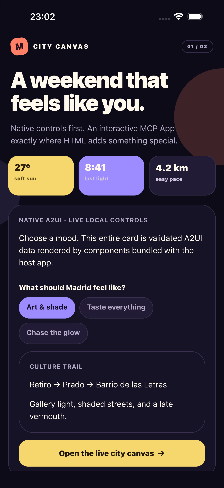
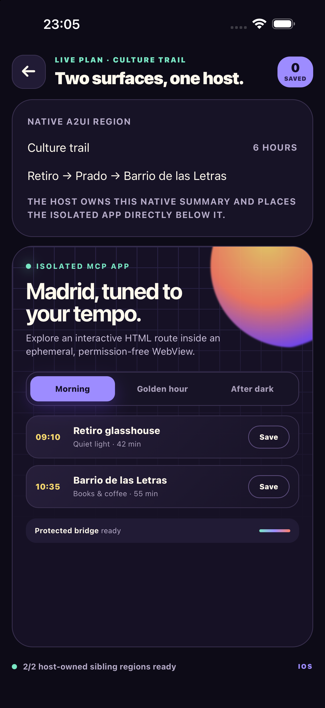

# City Canvas: native A2UI and an MCP App together

City Canvas is a two-screen Expo Go app built to answer a practical question: when should an MCP
interface be native, and when is a WebView the better canvas?

The first screen is React Native backed by a validated A2UI surface. Pick the kind of Madrid day
you want, then open the live plan. The second screen keeps a native A2UI summary at the top and
places an interactive MCP App below it as a sibling region. Inside the WebView you can change the
time of day and save a stop through a real, policy-approved MCP Apps tool call.

| Native discovery screen                              | Mixed native + MCP App screen                       | Host-approved saved stop                          |
| ---------------------------------------------------- | --------------------------------------------------- | ------------------------------------------------- |
|  |  |  |

## Run it in Expo Go

From a fresh clone, build the workspace packages and start the example:

```bash
npm ci
npm run build
cd examples/expo-go-mixed-surfaces
npm ci
npm start
```

Scan the QR code with Expo Go on Android or the Camera app on iOS. You can also press `a` or `i` in
the Expo terminal to use a local emulator or simulator. The app pins Expo SDK 57, React Native
0.86.3, and `react-native-webview` 14.0.1.

## What to try

1. On the first screen, switch between **Art & shade**, **Taste everything**, and **Chase the
   glow**. The choice is renderer-local A2UI state; it does not make a network call.
2. Open the live city canvas. The native route summary and isolated WebView are now two fixed
   siblings coordinated by the host.
3. Inside the MCP App, switch between Morning, Golden hour, and After dark. That interaction stays
   local to the HTML view.
4. Tap **Save** on a stop. The app requests `save_city_stop`; the bridge validates the message, the
   host policy checks the exact tool and stop ID, and only then does the native saved counter change.
5. Use the back button or Android system back. The host coordinator asks the focused regions first,
   then returns to the native discovery screen.

No remote server is required for the demo. The repository includes a fixed MCP Apps resource so
you can inspect the entire boundary. In a real host, the same resource object comes from
`loadMcpAppsResource()` after MCP negotiation and `resources/read`.

## How the pieces fit

```text
Screen 1
validated A2UI data ──► trusted React Native catalog ──► native discovery UI
                                                               │
                                                          host navigation
                                                               ▼
Screen 2
native A2UI summary ───────────────┐
                                   ├──► host-owned sibling layout + lifecycle
isolated MCP App WebView ──────────┘                    │
          │                                             │
          └── validated tool request ──► host policy ───┘
```

The important detail is what the diagram does not contain: there is no direct A2UI-to-WebView
channel. The native surface cannot create, configure, navigate, or message the WebView. The MCP App
cannot reach into the native component tree. Both can ask the host to handle declared actions, and
the host decides what happens.

| File                                                 | Responsibility                                                                   |
| ---------------------------------------------------- | -------------------------------------------------------------------------------- |
| [`App.tsx`](App.tsx)                                 | Owns navigation, selected mood, saved stops, and the surrounding app shell       |
| [`src/surfaces.ts`](src/surfaces.ts)                 | Creates and validates the native discovery and summary A2UI surfaces             |
| [`src/catalog.tsx`](src/catalog.tsx)                 | Maps closed semantic props to locally bundled React Native components            |
| [`src/mcp-app.ts`](src/mcp-app.ts)                   | Defines the MCP Apps resource, discovery metadata, tool, and exact host policy   |
| [`src/MixedPlanScreen.tsx`](src/MixedPlanScreen.tsx) | Creates the sandbox, bridge, fixed sibling registrations, lifecycle, and WebView |

## The native screen

The server-facing description contains semantic components and a binding, not React Native code:

```ts
const components = [
  {
    id: "vibe",
    component: "ChoicePicker",
    label: "What should Madrid feel like?",
    options: [
      { label: "Art & shade", value: "culture" },
      { label: "Taste everything", value: "food" },
      { label: "Chase the glow", value: "after-dark" },
    ],
    value: { path: "/vibe" },
  },
  {
    id: "open-plan",
    component: "Button",
    child: "open-plan-label",
    action: { event: { name: "open_live_plan" } },
  },
];
```

The host validates that lifecycle against `citySurfacePolicy`, then mounts it with the explicit
`cityCatalog`. A server cannot import a component or pass a React Native style object.

## The isolated MCP App

The example resolves an ordinary stable MCP Apps resource, then derives the restrictive native
sandbox and closed WebView props from it:

```ts
const resource = resolveMcpAppsResource(tool, readResult, negotiatedGrant);
const sandbox = createMcpAppsNativeSandbox(resource);

const webViewProps = createMcpAppsReactNativeWebViewProps(sandbox, {
  onMessage: (serialized) => bridge.receive(serialized),
  onError: reportHostError,
});
```

The resulting WebView has ephemeral storage, no cookies, no file access, no sensitive permissions,
no arbitrary navigation, and host-mediated downloads and external links. The HTML is still fully
interactive inside that boundary.

The **Save** button demonstrates the other direction. The bridge accepts only the declared
`save_city_stop` tool, and the host policy accepts only one known ID with no extra arguments:

```ts
handlers: {
  authorizeToolCall: authorizeSaveCityStop,
  callTool(_name, arguments_) {
    const stop = parseSavedStop(arguments_);
    if (stop === undefined) throw new Error("Unknown city stop");
    saveStop(stop);
    return createSavedStopResult(stop);
  },
}
```

## The mixed screen

The host registers one already validated native region and one exact resource/sandbox/bridge trio:

```ts
const nativeRegion = createMcpNativeMixedA2uiRegion({
  id: "native-route-summary",
  accessibilityLabel: "Native route summary",
  surface: summarySurface,
  policy: citySurfacePolicy,
});

const appRegion = createMcpNativeMixedMcpAppsRegion({
  id: "interactive-city-app",
  accessibilityLabel: "Interactive isolated city canvas",
  resource,
  sandbox,
  bridge,
});

const coordinator = new McpNativeMixedSurfaceCoordinator({
  regions: [nativeRegion, appRegion],
  initialFocusedRegionId: nativeRegion.id,
});
```

React Native still owns the actual layout. The coordinator serializes foreground/background,
visibility, focus, orientation, dynamic type, reduced motion, keyboard, back, crash recovery, and
disposal across the two regions.

The header button and Android system back both ask the focused regions to handle navigation before
the host changes screens. If the WebView process stops, **Reload securely** replaces the complete
inner mixed session. That gives the new document a fresh bridge, because an MCP Apps bridge is
initialized exactly once and must not be reused across WebView processes.

## Verify the example

Run its focused type and behavior checks:

```bash
npm run check
```

Build the same Hermes bundles consumed by Expo Go:

```bash
npm run bundle:ios
npm run bundle:android
```

The tests cover both native surface lifecycles, renderer-local input parsing, stable MCP Apps
resource construction, sandbox defaults, bridge initialization, the accepted tool call, and denied
tool arguments.
