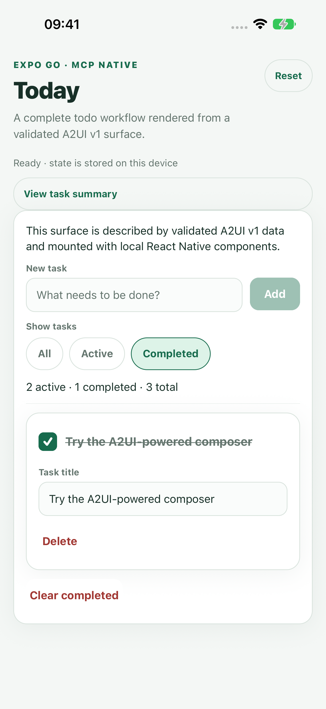
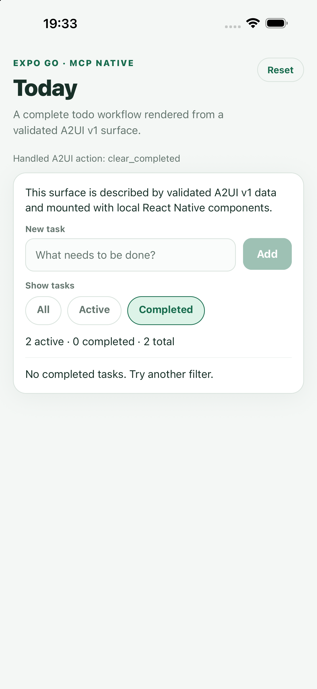

# MCP Native Expo Go todo app

This example shows how `@mcp-native/a2ui` and `@mcp-native/react-native` fit into a real Expo Go app.
It is a fully working todo list with local editing, filters, persistence, validation, and accessible
native controls. The walkthrough keeps the A2UI surface, host component catalog, action handling,
and storage code separate so each package boundary is easy to follow.

| All tasks                                         | Completed filter                                               | Empty state                                      |
| ------------------------------------------------- | -------------------------------------------------------------- | ------------------------------------------------ |
|  |  |  |

## Run it locally

From a fresh clone, build the workspace packages once and start the example:

```bash
npm ci
npm run build
cd examples/expo-go-todolist
npm ci
npm start
```

Scan the QR code with Expo Go on Android, or with the iPhone camera on iOS. You can also press `a`
or `i` in the Expo terminal to open a local emulator or simulator. The app pins Expo SDK 57, React
Native 0.86.3, and the local MCP Native workspace packages. Expo's
[Expo Go guide](https://docs.expo.dev/get-started/expo-go/) covers device setup and connection help.

The Metro configuration deliberately resolves `react` and `react-native` from this app while
watching the linked workspace packages. That keeps one React runtime when local `file:` dependencies
are used in this monorepo.

## What to try

- Add a task. The renderer returns an official, schema-validated A2UI action envelope to the host.
- Edit a title, complete or reactivate a task, and switch between All, Active, and Completed. These
  are renderer-local typed binding updates reconciled into host state.
- Delete one task or clear all completed tasks through explicit allowlisted actions.
- Reload Expo Go. Valid state is persisted with Expo SQLite's key-value store.
- Tap Reset to restore the three demonstration tasks.
- Increase system text size or use VoiceOver/TalkBack. Text scaling, labels, roles, state, live
  summaries, and 44-point touch targets are part of the native catalog.

The application caps the list at 200 tasks and each title at 120 characters. It rejects malformed
persisted state, unknown IDs, duplicate IDs, invalid filters, forged actions, unsupported
components, and oversized renderer input.

## How the packages fit together

The example keeps each responsibility visible:

| File                                 | Responsibility                                                                 |
| ------------------------------------ | ------------------------------------------------------------------------------ |
| [`src/surface.ts`](src/surface.ts)   | Creates the A2UI v1 lifecycle, data model, bindings, actions, and host policy  |
| [`src/catalog.tsx`](src/catalog.tsx) | Maps the closed semantic props to locally bundled React Native primitives      |
| [`App.tsx`](App.tsx)                 | Mounts the surface, receives action envelopes, owns state, and schedules saves |
| [`src/domain.ts`](src/domain.ts)     | Applies allowlisted actions and validates renderer-local changes               |
| [`src/storage.ts`](src/storage.ts)   | Loads and saves strictly parsed device state                                   |

The data flow is:

```text
host todo state
      │
      ▼
validated A2UI v1 lifecycle ──► trusted native render plan ──► local RN catalog
      ▲                                                            │
      │                                                            ▼
host action handler ◄── schema-valid action envelope       renderer-local bindings
      │                                                            │
      └──────────────── validated state reconciliation ◄───────────┘
```

### 1. Declare the allowlist and validate the lifecycle

The surface policy names every component, action, and pure function this app accepts:

```ts
export const todoSurfacePolicy = createBasicCatalogPolicy({
  allowedComponentNames: [
    "Button",
    "Card",
    "CheckBox",
    "ChoicePicker",
    "Column",
    "Divider",
    "List",
    "Row",
    "Text",
    "TextField",
  ],
  allowedEventNames: ["add_todo", "clear_completed", "delete_todo"],
  allowedFunctionNames: ["length", "required"],
});

const store = new SurfaceStore();
store.apply(createTodoSurfaceEnvelope(state));
const surface = store.getValidated("expo-go-todos", todoSurfacePolicy);
```

`createTodoSurfaceEnvelope` returns a real `createSurface` message with `sendDataModel: true`, a
dynamic `List`, typed data bindings, validation checks, and explicit event descriptors. In a host
connected to an MCP server, the validated JSON lifecycle received from the server enters the same
store and policy boundary.

### 2. Supply a host-owned catalog

The app passes an explicit catalog. The server can request only negotiated semantic names; it
cannot import a component, pass arbitrary props, or choose executable code:

```tsx
export const todoCatalog: NativeComponentCatalog = {
  View: BaseView,
  Text: SurfaceText,
  Button: DefaultButton,
  TextInput: SurfaceInput,
  CheckBox: SurfaceCheckBox,
  ChoicePicker: SurfaceChoicePicker,
  Divider: SurfaceDivider,
  variants: {
    View: { card: SurfaceCard, column: SurfaceColumn, list: SurfaceList, row: SurfaceRow },
    Button: { borderless: BorderlessButton, default: DefaultButton, primary: PrimaryButton },
    TextInput: { shortText: SurfaceInput },
  },
};
```

The complete source includes every variant required by the renderer and maps only the trusted props
that each local primitive needs.

### 3. Mount the native surface

`Surface` owns the renderer-local model and returns validated changes and action
envelopes through host callbacks:

```tsx
<Surface
  actionMetadata={{
    extensions: { example: "expo-go-todolist", host: Platform.OS },
  }}
  components={todoCatalog}
  locale="en"
  onAction={handleAction}
  onDataModelChange={handleDataModelChange}
  policy={todoSurfacePolicy}
  surface={surface}
/>
```

Action metadata uses the official `metadata.extensions` shape. The renderer validates the complete
renderer-to-agent envelope before the host receives it.

### 4. Keep transport and persistence in the host

The callback applies only the three allowlisted app actions. A production MCP host can route the
same validated envelope through its consent and tool-dispatch policy:

```ts
const handleAction = (envelope: ActionEnvelope, dataModel?: JsonObject) => {
  setState((current) =>
    applyTodoAction(current, envelope.action.name, envelope.action.context, dataModel, createId),
  );
};

const handleDataModelChange = (dataModel: JsonObject) => {
  setState((current) => reconcileRendererModel(current, dataModel));
};
```

MCP Native intentionally does not send actions on its own. The host still owns MCP transport,
authorization, consent, persistence, and device capabilities.

## Verify the example

Run the focused type and behavior checks:

```bash
npm run check
```

Build the same JavaScript bundles Expo Go consumes:

```bash
npm run bundle:ios
npm run bundle:android
```

The tests cover the lifecycle schema, trusted render plan, add/edit/toggle/filter/delete/clear
behavior, persistence parsing, forged renderer input, and application-level size limits.
